# Autoattended-Orchestrator-Spezifikation

> **Sprache:** Deutsch · siehe `../autoattended-orchestrator-spec.md` für die englische Quellfassung.
>
> **Status:** DRAFT  ·  **Version:** 0.1.0  ·  **Stand:** 2026-05-17
> **Format:** NLSpec (nach [strongdm/attractor](https://github.com/strongdm/attractor))
> **Substrat:** Designed um auf `attractor-spec.md` zu komponieren; läuft
> als der `house`-shaped `manager_loop`-Node einer Attractor-Pipeline.

---

## §1 Überblick

### §1.1 Zweck

Der Autoattended-Orchestrator fährt Wave-basierte Fan-out- / Fan-in-
Sprints von LLM-Worker-Agents gegen eine Codebase, mit vier
spezialisierten Review-Gates (den „4 Savants") an fixen Lifecycle-
Positionen. Es ist die Projekt-agnostische Distillation des Patterns,
das in
[`AdaWorldAPI/WoA/.claude/v0.1/CLAUDE-CONTEXT.md`](https://github.com/AdaWorldAPI/WoA/blob/main/.claude/v0.1/CLAUDE-CONTEXT.md)
beschrieben und über 26 Repositories am 2026-05-17 gehardent wurde.

### §1.2 Zentrale Abstraktionen

- **Wave**: ein paralleler Fan-out von N Worker-Agents (typisch N = 12),
  endend in einem einzelnen Consolidation-Commit durch den Orchestrator.
  Ein Sprint ist eine Sequenz von Waves.
- **Worker**: ein LLM-Agent-Process der ein **Bundle** von Files
  besitzt. Workers laufen isoliert (`isolation: "worktree"`), lesen
  nicht den In-Flight-State anderer Workers, koordinieren nur über
  den Orchestrator und das File-Blackboard.
- **Savant**: eine von vier spezialisierten Review-Rollen (PP-13 /
  PP-14 / PP-15 / PP-16), die den Sprint an fixen Lifecycle-Positionen
  gaten.
- **Iron Rule**: eine nicht-überschreibbare Invariante, deklariert in
  `INVARIANTS.md`, durchgesetzt von jedem Worker und vom Meta-Agent
  beim PR-Review.

### §1.3 Relation zu `attractor-spec.md`

Der Orchestrator ist realisierbar als Attractor-Pipeline, deren
DOT-Graph die kanonische Form hat:

```
start (Mdiamond)
  → preflight-drift-auditor (box, PP-16 Verdict-Gate)
  → fan-out (component, N=12)
  → fan-in (tripleoctagon, Consolidation-Commit)
  → baton-handoff-auditor (box, PP-15)
  → brutally-honest-tester (box, PP-13, goal_gate=true, retry_target=fan-out)
  → exit (Msquare)
```

PP-14 (convergence-architect) läuft bei PRE-PLAN, *außerhalb* des
Graphen, auf dem proposed Sprint-Plan bevor der Graph gerendert wird.

### §1.4 Was diese Spec NICHT ist

- Kein Pipeline-Runner. Sie nimmt an, dass attractor-spec.md (oder
  ein Equivalent) die Runtime ist.
- Kein Coding-Agent-Loop. Per-Worker-Verhalten ist in
  [`anti-skim-agent-spec.md`](./anti-skim-agent-spec.md).
- Kein Koordinations-Transport. Der Cross-Agent-Message-Bus ist in
  [`agent-coordination-mcp-spec.md`](./agent-coordination-mcp-spec.md).

---

## §2 Terminologie

| Begriff | Definition |
|---|---|
| **Sprint** | Eine Sequenz aus einer oder mehreren Waves auf ein einzelnes geplantes Outcome (ein Feature, ein Port, ein Refactor). |
| **Wave** | Ein paralleler Fan-out + Fan-in-Zyklus. |
| **Bundle** | Das Set von Files, das ein Worker besitzt (read-write); deklariert in `META/SPRINT-N-PLAN.md`. |
| **Ownership-Tabelle** | Das Per-Worker-Mapping Bundle → owned-files + read-only-files. |
| **Iron Rule** | Eine nicht-überschreibbare Invariante; Verletzung ist eine P0-Finding. |
| **Goal-Gate** | Ein Node, dessen Verdict SUCCESS sein MUSS damit die Wave exiten kann. Implementiert attractor §3.4. |
| **Savant** | PP-13 / PP-14 / PP-15 / PP-16. Siehe §4. |
| **Meta-Agent** | Der 13. Agent. Besitzt Plan-Review, Inbox-Drain, PR-Review. |
| **REQUESTS-FROM-AGENTS.md** | Die append-only Inbox für Stuck-Worker-Messages. |
| **INVARIANTS.md** | Die Single-Source-of-Truth für Cross-Cutting-Rules. |

---

## §3 Der Wave-Loop

### §3.1 Sechs Steps

```
1. Plan        → Orchestrator partitioniert Arbeit in N Bundles
2. Sprint      → N parallele Worker-Agents
3. Meta-Review → ein oder mehrere Savant-Agents
4. Fix P0s     → Orchestrator wendet Fixes an + verifiziert Tier-1-Gates
5. Commit + PR → Orchestrator (ein PR pro Bundle ODER ein kombinierter PR)
6. Repeat      → Orchestrator plant die nächste Wave
```

### §3.2 Eine Iron Rule über alle Steps

Der Orchestrator ist die einzige Rolle, die außerhalb des
zugewiesenen Bundles schreiben darf. Workers bleiben in ihrer Lane.
Savants sind read-only (sie filen Findings; der Orchestrator wendet
Fixes an).

### §3.3 Wave-Sizing

| Wave-Size | Worker-Model | Wann nutzen |
|---|---|---|
| 3-6 | Mid-Tier (z. B. Sonnet) | Tight Scope, wohldefinierte Bundles, niedrige Cross-Cutting-Concern |
| 7-12 | Mid-Tier | Die Standard-Wave-Form — die meiste Arbeit passt hier |
| > 12 | Mid-Tier, split | Pre-fan in 2 Waves mit Savant-Pass dazwischen |
| 1-2 (Planning) | Top-Tier (z. B. Opus) | Architektur / Design / Cross-Cutting-Entscheidungen |
| 1 (Savant) | Mid-Tier oder Top-Tier | Per §4 |

Eine 12-Worker-Wave kostet ungefähr **250.000 bis 350.000 Input-
Tokens** (Bundle-Briefings + Reference-Reads) plus **30.000 bis
50.000 für den Savant-Pass**. Implementierungen MÜSSEN das gegen das
Context-Window-Budget des Models pro Worker tracken und Pläne
ablehnen, deren Per-Bundle-Brief `worker.max_brief_tokens`
übersteigt.

### §3.4 Der Consolidation-Pass (Step 5 ⇒ atomic Commit)

Nachdem alle Workers in einer Wave zurück sind, macht der
Orchestrator EINEN Consolidation-Commit der:

1. Die Commits jedes Bundles in Dependency-Order reinholt
2. Die append-only Merge-Zones (Module-Registry, Integration-Test-
   List etc.) auflöst, die in INVARIANTS.md deklariert sind
3. Tier-1-Gates gegen den kombinierten State re-runs (siehe
   [`anti-skim-agent-spec.md`](./anti-skim-agent-spec.md))
4. Einen PR fileed (oder N PRs wenn Bundles wirklich independent)

Implementierungen DÜRFEN NICHT 12 Mini-Commits am shared Registry-File
erlauben. Worker-Pushes zu Shared-Registry-Files werden auf der
Worker-Layer abgelehnt (per Unique-File-Write-Rule, §5.1).

---

## §4 Die 4 Savant-Slots

### §4.0 Mindsets (nicht Rollen)

Jeder Savant ist ein **Mindset** — eine Denkweise, kein Checklist-
Operator. Das Verdict-Vokabular in §4.1 ist der *Output*; das
Mindset in dieser Section ist der *Input*, den der System-Prompt
des Savants aktivieren sollte.

| Savant | Mindset-Persona | Frame durch den sie lesen | Failure, gegen die sie existieren |
|---|---|---|---|
| **PP-13 brutally-honest-tester** | Der Implementierungs-Principal, der seit zehn Jahren shipped + on-Call macht | „was würde in Production um 3 Uhr morgens brechen, was der Author sich weggeredet hat?" | Self-Deception in Implementation-Quality-Claims |
| **PP-14 convergence-architect** | Der Creative-Design / F&E-Principal, der divergente Möglichkeiten exploriert | „was könnte das werden, das wir nicht sehen? welche latente shared Form wird dupliziert?" | Premature Convergence und versäumte Cross-Slice-Synergien |
| **PP-15 baton-handoff-auditor** | Der DTO- / Interface-Architekt — die Person, die in den Lücken zwischen Komponenten lebt | „lining sich diese Contracts an den Nähten wirklich auf? wessen Hand geht als nächste an den Stab?" | Cross-Boundary-Drift; silent Contract-Shape-Mismatches |
| **PP-16 preflight-drift-auditor** | Der Principal-System-Architekt mit dem vollen System-State im Kopf | „matched der Plan immer noch das System wie es jetzt gerade ist, oder hat sich Main bewegt während wir geplant haben?" | Stale Plans gegen ein bewegtes Main; dropped Requirements |

Der System-Prompt für jeden Savant SOLLTE mit dem Mindset-Satz
beginnen, nicht mit der Verdict-Checklist. Die Checklist ist ein
Backstop; das Mindset ist die Linse.

### §4.1 Slot-Tabelle

| Savant | Phase | Owns | Verdict-Vokabular |
|---|---|---|---|
| **PP-13 brutally-honest-tester** | POST-IMPL | Within-Bundle Compile / Lint / Test / Spec-Match | LAND / HOLD / REJECT |
| **PP-14 convergence-architect** | PRE-PLAN | Divergent Ideation, latente shared Infrastructure | OPPORTUNITY-NOW / WORTH-EXPLORING / DROP (nie REJECT) |
| **PP-15 baton-handoff-auditor** | DURING-IMPL | Cross-Bundle- / Cross-Crate- / Cross-Module-Boundary-Contracts | CATCH-CRITICAL / CATCH-LATENT / CLEAN |
| **PP-16 preflight-drift-auditor** | PRE-SPAWN | Spec-vs-Main-Drift, hand-waved Scope, dropped Requirements | SPAWN-CLEAR / SPAWN-CAUTION / SPAWN-BLOCKED |

### §4.2 Verdict-Vokabular-Nicht-Überlappung ist eine Design-Invariante

Jeder Savant hat ein **nicht-überlappendes Verdict-Vokabular**, damit
eine Finding nicht über Phasen wandern kann ohne re-klassifiziert zu
werden. Der Meta-Agent nutzt sein eigenes Vokabular (GO /
GO-WITH-CONDITIONS / BLOCK für Plan-Review; P0 / P1 für PR-Review).

Wenn ein Savant ein Verdict aus dem Vokabular eines anderen Savants
returned, wird die Finding beim Intake abgelehnt und zurückgeroutet.
Das ist ERROR-Severity in Validation (§7).

### §4.3 Non-Use → Route-Tabelle

Jeder Savant-Prompt MUSS explizite „non-use → route to PP-X"-Lines
enthalten. Beispiele:

- PP-13 findet ein Cross-Crate-Boundary-Issue → route zu **PP-15**.
- PP-15 findet ein Spec-vs-Main-Drift → route zu **PP-16**.
- PP-16 findet ein Within-Bundle-Compile-Error → route zu **PP-13**.
- PP-14 findet irgendetwas Compile-related → route zu **PP-13**.

### §4.4 PP-13-Spezifika

Owns die kanonische Toolchain Tier-1+2+3. Tier 1 läuft jeder PR;
Tiers 2+3 Opt-in. Siehe
[`anti-skim-agent-spec.md` §8](./anti-skim-agent-spec.md#8-toolchain-tiers)
für die Language-Adapter-Tabellen.

Anti-Pattern-Katalog: AP1..AP8.

### §4.5 PP-15-Spezifika

Owns Cross-Boundary-Commands: Workspace-Level-Lint/Typecheck,
Public-API-Diff (`cargo public-api`, `api-extractor`, `griffe check`),
Cross-Symbol-Grep, Cross-Repo `git log`, Metadata-Dump.

Anti-Pattern-Katalog: BAP1..BAP10. Acht Boundary-Klassen:
Module-Module, Crate-Crate, Package-Package, Repo-Repo, Public-API,
DTO/Wire-Format, DB-Schema-to-ORM, CLI-Surface.

### §4.6 PP-16-Spezifika

Owns Git + Grep only — `git log master`, `git show`,
`git diff main...HEAD`, list-pull-requests, Grep alter Symbole über
`.claude/plans/` und `.claude/specs/`. Läuft KEIN Compile/Test/Lint.

Anti-Pattern-Katalog: PD1..PD10. Sechs Achsen: Plan-vs-Main-HEAD,
Plan-vs-Open-PRs, Plan-vs-Recent-Merges, Plan-vs-RFC-Status,
Plan-vs-Invariants, Plan-vs-Spec.

### §4.7 PP-14-Spezifika

Owns Surface-Inspection only (z. B. `cargo doc`, `cargo tree`,
`cargo expand`) plus WebSearch / Paper-Search für Cross-Pollination.
Hat KEINE Compile/Test-Gates. Anti-Pattern-Katalog: EP1..EP8.

---

## §5 Worker-Iron-Rules

### §5.1 Unique-File-Write-Disziplin

Jeder Worker schreibt in eine **eindeutige neue File** in seinem
Bundle. Nie zwei Workers an der gleichen existierenden File
gleichzeitig. Append-Conflicts sind garantiert wenn verletzt.

Shared-Merge-Zones (Module-Registry, Integration-Test-List) MÜSSEN
explizit in INVARIANTS.md als **append-only** deklariert sein: jeder
Worker append eine Zeile; der Orchestrator löst Order im
Consolidation-Commit. Worker-Pushes zu undeklarierten Shared-Files
sind ERROR-Severity (§7).

### §5.2 Worktree-Branches starten von `origin/<base>`, nicht der lokalen Working-Branch

Eine Worktree-Branch gestartet von einer stale lokalen Working-Branch
verpasst silently Sibling-Worker-Commits. Workers MÜSSEN:

```bash
git fetch origin <base-branch>
git checkout -b agent/N <fresh-origin-ref>
```

Implementierungen MÜSSEN `isolation: "worktree"` für jeden Worker-
Spawn setzen.

### §5.3 Atomic Consolidation-Pass

Siehe §3.4. Der Orchestrator macht EINEN Consolidation-Commit pro
Wave, nicht N Mini-Commits.

### §5.4 Pre-Wave-Helper-Call-Audit

Vor dem Fan-out scannt der Orchestrator jedes Bundle nach
uncommitted Helper-Call-Dependencies. Bundles mit non-zero
unresolved-helper-Count benötigen einen **Helper-Hoist** committed
vor dem Fan-out. Sonst inventieren N Workers den gleichen Helper N
verschiedene Wege. Das ist PP-14s Job bei PRE-PLAN.

### §5.5 Chunking-Disziplin (die load-bearing Iron Rule)

Files größer als ~150 Zeilen MÜSSEN via `tee -a` in Chunks geschrieben
werden, mit einem Commit pro Chunk. NIEMALS ein 500-Zeilen-Heredoc +
Commit + Push in derselben Runde. Connection-Drops mid-serialize
verlieren Arbeit.

Der `tee -a`-Loop hat doppelte Pflicht: Chunking (File-Size) UND
Agent-Logging (Status-Zeile an `AGENT_LOG.md` nach jedem Chunk).

### §5.6 Source-Quoting-Commit-Messages

Für Ports und Behavior-Preserving-Rewrites: jede Commit-Message
quoted die Source-File + Line-Range für die portierte Funktion.
Reviewer können `grep -rn "Source: " <target-dir>/` machen um jedes
Port-Site zu finden. Ohne das kreucht Behavior-Drift unsichtbar rein.

---

## §6 Sprint-Plan-Format

### §6.1 Der Plan ist ein DOT-Graph (oder YAML-Mirror)

Ein Sprint-Plan ist ein DOT-Graph (per attractor-spec.md §2) oder
sein Equivalent in YAML. Die kanonische Wave-Form ist in §1.3.

### §6.2 Required Node-Attribute pro Bundle

Jeder `box`-shaped Worker-Node MUSS deklarieren:

```
[
  agent_id="A4",
  bundle_name="customer-master-data",
  owned_files="src/customer/master.rs,src/customer/master/types.rs",
  read_only_files="../WoA/woa/blueprints/customer.py,../WoA/models.py",
  spec_files="vendor/ogit/NTO/WorkOrder/entities/customer.ttl",
  sentinel_token="WAVE-12-A4-7f3c",
  proof_of_read=true,
  worker_model="sonnet",
  isolation="worktree",
  status_file=".claude/board/wave-12/A4-status.json"
]
```

### §6.3 Required Edge-Attribute

| Attribut | Werte | Default |
|---|---|---|
| `condition` | Expression über `outcome` und `context.*` | `outcome==SUCCESS` |
| `fidelity` | `full` / `compact` / `summary:medium` / `truncate` | `compact` |
| `route_on_fail` | Node-ID | `null` |

### §6.4 YAML-Mirror (wenn DOT nicht verfügbar)

```yaml
sprint:
  id: SPRINT-12-customer-master
  wave_size: 12
  base_branch: origin/main
  workers:
    - agent_id: A4
      bundle_name: customer-master-data
      owned_files: [src/customer/master.rs, src/customer/master/types.rs]
      read_only_files: [../WoA/woa/blueprints/customer.py, ../WoA/models.py]
      spec_files: [vendor/ogit/NTO/WorkOrder/entities/customer.ttl]
      sentinel_token: WAVE-12-A4-7f3c
      proof_of_read: true
      worker_model: sonnet
      isolation: worktree
      status_file: .claude/board/wave-12/A4-status.json
  savants:
    pre_plan: PP-14
    pre_spawn: PP-16
    during_impl: PP-15
    post_impl: PP-13
  goal_gate: PP-13
  retry_target: fan-out
```

---

## §7 Validierungs-Regeln

Implementierungen MÜSSEN diese Lints gegen jeden Sprint-Plan vor
dem Fan-out laufen lassen. Severity matched die Konvention von
attractor-spec.md §7.

| Regel | Beschreibung | Severity |
|---|---|---|
| `WAVE-001 unique-write` | Keine zwei Bundles listen die gleiche File unter `owned_files`. | ERROR |
| `WAVE-002 declared-shared` | Jede File die in zwei `owned_files` von Bundles auftaucht MUSS als `append-only` in INVARIANTS.md deklariert sein, sonst ERROR. | ERROR |
| `WAVE-003 sentinel-token-present` | Jeder Worker-Node MUSS ein eindeutiges `sentinel_token` haben. | ERROR |
| `WAVE-004 proof-of-read-required` | `proof_of_read=true` ist Pflicht; `false` braucht expliziten human Override im Commit-Body. | ERROR |
| `WAVE-005 goal-gate-has-retry` | Wenn ein Node `goal_gate=true` hat, MUSS er auch ein `retry_target` haben. (Übernommen von attractor §7.2.) | ERROR |
| `WAVE-006 isolation-worktree` | Jeder Worker-Node MUSS `isolation="worktree"` deklarieren. | ERROR |
| `WAVE-007 status-file-path` | Jeder Worker-Node MUSS einen `status_file`-Path deklarieren, eindeutig für diese Wave. | ERROR |
| `WAVE-008 worker-brief-size` | Das gerenderte Brief für jeden Worker DARF `worker.max_brief_tokens` (Default 8000) NICHT überschreiten. | WARNING |
| `WAVE-009 helper-hoist` | Pre-Wave-Helper-Call-Audit (§5.4) MUSS Zero unresolved-Helpers liefern. | WARNING |
| `WAVE-010 verdict-vocabulary` | Jedes Savant-Verdict MUSS aus seinem eigenen Vokabular (§4.2) sein. Cross-Vokabular-Verdicts werden zurückgeroutet. | ERROR |
| `WAVE-011 auto-status-false` | `auto_status` MUSS `false` sein. Fehlender Status MUSS als FAIL behandelt werden. (Kollidiert mit attractors Default.) | ERROR |
| `WAVE-012 reachability` | Jeder Node ist erreichbar von `start`. (Übernommen von attractor §7.2.) | ERROR |
| `WAVE-013 start-exit` | Exakt ein `start`, mindestens ein `exit`. (Übernommen von attractor §7.2.) | ERROR |
| `WAVE-014 inbox-drained` | Bei Wave-Start MUSS REQUESTS-FROM-AGENTS.md keine unbeantworteten Einträge aus prior Waves haben. | WARNING |
| `WAVE-015 invariants-fresh` | Jedes Worker-Brief MUSS die SHA-256 von INVARIANTS.md enthalten und der Worker MUSS Proof-of-Read darauf machen. | ERROR |

---

## §8 Konfiguration

```yaml
# .claude/ATT/config/orchestrator.yaml
orchestrator:
  wave_size:
    default: 12
    min: 1
    max: 24
  worker:
    max_brief_tokens: 8000
    isolation: worktree                # MUSS worktree sein
    proof_of_read: required             # required | optional (Default required)
    auto_status: false                  # MUSS false sein
  consolidation:
    one_pr_per_bundle: false            # true | false (false = ein kombinierter PR)
    re_run_tier_1: true                 # MUSS true sein
  savants:
    pre_plan: PP-14
    pre_spawn: PP-16
    during_impl: PP-15
    post_impl: PP-13
    goal_gate_owner: PP-13
  retry:
    max_replans_per_sprint: 3
    on_partial_failure: redispatch_with_tighter_scope
  budget:
    wave_max_input_tokens: 350000
    savant_max_input_tokens: 50000
    warn_if_exceeds: 0.8                # Warnung bei 80% des Budgets
```

---

## §9 Status-File-Schema

### §9.1 Übernahme von Attractors status.json mit `auto_status=false`

Jeder Worker MUSS eine `status.json` an seinen deklarierten
`status_file`-Path schreiben. Schema cribbed aus attractor
Appendix C und verschärft:

```json
{
  "agent_id": "A4",
  "bundle_name": "customer-master-data",
  "sentinel_token": "WAVE-12-A4-7f3c",
  "outcome": "SUCCESS",
  "preferred_label": "land",
  "suggested_next_ids": [],
  "context_updates": {
    "customer.master.files_created": 3,
    "customer.master.parity_tests_passed": 7
  },
  "notes": "zwei Helper-Funktionen hoisted in src/customer/_shared.rs (bereits append-only in INVARIANTS.md §AppendOnly deklariert)",
  "proof_of_read": [
    { "file": "INVARIANTS.md", "sha256": "...", "lines": 412, "depth": "thorough" },
    { "file": "../WoA/woa/blueprints/customer.py", "sha256": "...", "lines": 891, "depth": "full" },
    { "file": "vendor/ogit/NTO/WorkOrder/entities/customer.ttl", "sha256": "...", "lines": 137, "depth": "full" }
  ],
  "tier_1_gates": {
    "lint": "GREEN",
    "fmt": "GREEN",
    "audit": "GREEN",
    "deny": "GREEN",
    "typecheck": "GREEN",
    "tests": { "passed": 14, "failed": 0 }
  }
}
```

### §9.2 Die fünf Outcomes

| Outcome | Bedeutung |
|---|---|
| `SUCCESS` | Alle Tier-1-Gates grün; Spec-Contract erfüllt; ready für PR. |
| `PARTIAL_SUCCESS` | Bundle-Arbeit shipped, aber eine definierte Sub-Task deferred (filed in `Altlasten.md` / `TECH_DEBT.md`). |
| `RETRY` | Self-detected Stuck-Loop (per `anti-skim-agent-spec.md` §6) oder Token-Budget-Exhaustion. Orchestrator re-spawned mit engerem Scope. |
| `FAIL` | Tier-1-Gates rot, ODER Proof-of-Read fehlt, ODER Sentinel-Token failed, ODER Iron Rule verletzt. |
| `SKIPPED` | Die Preconditions des Bundles (z. B. ein Dependency-Bundle) wurden nicht erfüllt. |

### §9.3 Missing-Status-Policy

`auto_status=false` ist Pflicht. Wenn ein Worker exit'ed ohne
`status_file` zu schreiben, MUSS der Orchestrator die Wave als FAIL
für dieses Bundle behandeln.

Hier kollidieren wir absichtlich mit attractors `auto_status=true`-
Default. Siehe [`README.md` „Wo es kollidiert"](./README.md#wo-es-mit-attractors-haltung-kollidiert-und-warum-wir-bei-unserer-position-bleiben).

---

## §10 Definition von Fertig (Konformanz-Checklist)

Eine Implementierung ist konform, wenn sie ALLE erfüllt:

- [ ] Sprint-Pläne sind DOT-Graphen oder §6.4-YAML-Mirrors mit
      allen Required Node-Attributen (§6.2) und Edge-Attributen (§6.3).
- [ ] Validierungs-Regeln §7 WAVE-001 bis WAVE-015 laufen als Teil
      von `preflight-drift-auditor` und blocken Fan-out bei ERROR.
- [ ] Jeder Worker spawned mit `isolation: "worktree"` (§5.2).
- [ ] Jeder Worker schreibt eine `status.json` matching das §9.1-Schema.
- [ ] Fehlende `status.json` wird als FAIL behandelt (`auto_status=false`).
- [ ] Die vier Savants sind präsent mit nicht-überlappenden Verdict-
      Vokabularen (§4.2) und expliziten Non-Use-Route-Tabellen (§4.3).
- [ ] PP-13 owns die Sprach-spezifische Tier-1-Toolchain
      (`anti-skim-agent-spec.md` §8).
- [ ] PP-15 owns BAP1..BAP10 + 8 Boundary-Klassen (§4.5).
- [ ] PP-16 owns PD1..PD10 + 6 Achsen (§4.6) plus die §7-Validierungs-
      Regeln.
- [ ] Worker-Briefs deklarieren `proof_of_read: true` und ein
      eindeutiges `sentinel_token` (§6.2).
- [ ] Der Meta-Agent (die 13. Rolle) drained REQUESTS-FROM-AGENTS.md
      ≥ 2× pro Tag während einer Wave (4h-Reply-Latency-Target).
- [ ] PR-Review klassifiziert Findings NUR als P0 oder P1; nie P2/P3.
- [ ] `INVARIANTS.md` ist ≤ 500 Zeilen; Split required oberhalb.
- [ ] Ein Consolidation-Commit pro Wave am Shared-Registry (§3.4);
      Zero N-Mini-Commit-Anti-Pattern detected.
- [ ] Chunking-Disziplin durchgesetzt: Files > 150 Zeilen via
      `tee -a` geschrieben (§5.5).
- [ ] Source-Quoting-Commit-Messages auf allen Ports (§5.6).
- [ ] Context-Fidelity-Ladder (§11) ist implementiert mit Vorrang
      edge > node > graph > default und die §11.2-Token-Budgets
      als Guidance behandelt (Hard-Cap ist `worker.max_brief_tokens`).
- [ ] `fidelity=truncate` enthebt einen Worker NICHT von der
      `anti-skim-agent-spec.md` §3.3-Reading-Depth-Ladder.

---

## §11 Cross-Language-Parity-Matrix

| Aspekt | Rust | Python | TypeScript | Go |
|---|---|---|---|---|
| Tier-1-Lint | `cargo clippy --all-targets --all-features -- -D warnings` | `ruff check` | `eslint --max-warnings 0` | `golangci-lint run` |
| Tier-1-Format-Check | `cargo fmt --check` | `ruff format --check` | `prettier --check` | `gofmt -l` |
| Tier-1-Advisory-Scan | `cargo audit` | `pip-audit` | `npm audit --omit=dev` | `govulncheck ./...` |
| Tier-1-Dep-Policy | `cargo deny check` | `deptry .` | (Projekt-definiert) | `go vet -all` |
| Tier-1-Typecheck | (Clippy impliziert) | `mypy --strict` | `tsc --noEmit --strict` | (Compiler impliziert) |
| Tier-1-Tests | `cargo test --all-features` | `pytest` | `vitest run` | `go test ./...` |
| Module-Registry append-only File | `src/lib.rs` / `mod.rs` | `__init__.py` | `index.ts` / `index.js` | `pkg.go` |
| Workspace-Metadata | `cargo metadata` | `pipdeptree` | `pnpm list --depth=2` | `go list -m all` |
| Public-API-Diff | `cargo public-api` | `griffe check` | `api-extractor run` | `apidiff` |

---

## §11A Context-Fidelity

> **Übernommen aus `attractor-spec.md` §5.4.** Das ist die einzige
> Übernahme, die ihre eigene Section braucht, weil sie ändert, wie
> Briefs an Workers gerendert werden.
>
> *Hinweis: In der englischen Quelle trägt diese Section irrtümlich
> auch die Nummer §11 (Konflikt mit §11 Cross-Language-Parity-Matrix).
> Die deutsche Fassung nutzt §11A bis das in der EN-Quelle aufgeräumt
> ist.*

### §11A.1 Warum Fidelity wichtig ist

Eine 12-Worker-Wave läuft das Brief des Orchestrators durch jeden
Worker. Wenn jeder Worker den vollen Orchestrator-Context erbt,
skaliert der Input-Token-Cost einer Wave linear mit
Workers × shared-Context-Size, was verschwendet wenn Bundles klein
und wohl-scoped sind.

Fidelity-Modes lassen den Orchestrator pro-Edge / pro-Node / pro-
Graph einstellen, wie viel von seinem Context jeder Worker erbt.

### §11A.2 Vier Modes + Token-Budgets

| Mode | Token-Budget (ca.) | Wann nutzen |
|---|---|---|
| `full` | unbounded (Worker erbt den ganzen Orchestrator-Thread) | Trusted Same-Domain-Handoff; selten; Default OFF |
| `compact` | ~3000 Tokens (Bundle-Ownership-Tabelle + INVARIANTS-SHA + Parity-Contract only) | **Default** für Standard-Workers |
| `summary:medium` | ~1500 Tokens (auto-generierte Summary des Orchestrator-Contexts, ~15-line max) | Budget-bewusste Waves; > 12 Workers |
| `summary:low` | ~600 Tokens (One-Paragraph-Summary) | Trivial Workers (z. B. Doc-Touch only) |
| `truncate` | ~200 Tokens (Goal + Bundle-Name + Sentinel only) | Smoke-Test-Workers; nie für Code-Writing |

Diese Budgets sind Guidance, keine Hard-Caps; der Hard-Cap ist
`worker.max_brief_tokens` (Default 8000, konfigurierbar per §8).

### §11A.3 Vorrang-Ladder

Per attractor §5.4 wird Fidelity mit Vorrang edge > node > graph >
default aufgelöst:

```
worker.fidelity =
    edge_attribute(orchestrator → worker, "fidelity")        # falls gesetzt
 || node_attribute(worker, "fidelity")                        # sonst
 || graph_attribute(sprint_graph, "default_fidelity")         # sonst
 || "compact"                                                 # built-in Default
```

### §11A.4 Interaktion mit Proof-of-Read

Fidelity kontrolliert, was der **Orchestrator** an den Worker
weitergibt. Sie kontrolliert NICHT, was der **Worker** von Disk
liest. Ein Worker auf `fidelity=truncate` MUSS dennoch die §3.3 von
[`anti-skim-agent-spec.md`](./anti-skim-agent-spec.md) Reading-Depth-
Ladder auf jeder File ausführen, die er anfasst.

Insbesondere:

- Ein Worker auf `fidelity=truncate`, dessen Brief nur „Goal +
  Bundle-Name + Sentinel" enthält, MUSS dennoch INVARIANTS.md
  `thorough` lesen vor jedem Commit (per anti-skim-agent-spec.md §3.3).
- Ein Worker auf `fidelity=full` skipped NICHT Proof-of-Read auf
  Files, die im inherited Context summarisiert wurden — die inherited
  Summary ist KEIN Substitut für den Read (die gleiche Regel, die
  eine Compaction-Summary nicht zum Substitut für die JOURNAL-File macht).

### §11A.5 Validierungs-Regel

| Regel | Beschreibung | Severity |
|---|---|---|
| `WAVE-016 fidelity-budget` | Wenn ein Worker-Node `fidelity=truncate` deklariert UND `tier_1_gates` required sind, MUSS der Orchestrator verifizieren, dass das Brief des Workers die §6.2-Required-Attribute immer noch enthält. | ERROR |
| `WAVE-017 fidelity-precedence` | Die §11A.3-Precedence wird beachtet; konfliktende Deklarationen lösen sich in der Reihenfolge edge > node > graph > default auf. | WARNING |

### §11A.6 Worked-Beispiel

Eine Wave-12-Sprint mit gemischten Bundle-Sizes:

```yaml
sprint:
  default_fidelity: compact
  workers:
    - agent_id: A1       # großes Bundle, cross-cutting
      fidelity: full     # Node-Override
    - agent_id: A2       # Standard-Bundle
      # nutzt Default 'compact'
    - agent_id: A3       # winziges Bundle, fasst nur Docs an
      fidelity: summary:low   # Node-Override
    - agent_id: A4       # nur Smoke-Test
      fidelity: truncate
  edges:
    - from: A1
      to: fan_in
      fidelity: full     # Edge-Override — A1s Resultat ans Fan-In bei voller Fidelity
```

---

## §12 Appendix A — Kanonischer Wave-DOT-Graph

```dot
digraph wave_12_customer_master {
  rankdir=LR;
  start [shape=Mdiamond, label="start"];
  exit  [shape=Msquare,  label="exit"];

  // PRE-SPAWN
  pp16 [shape=box,
        label="PP-16 preflight-drift-auditor",
        owner="meta-agent",
        verdicts="SPAWN-CLEAR / SPAWN-CAUTION / SPAWN-BLOCKED",
        validation_rules="WAVE-001..WAVE-015"];

  // DURING-IMPL Fan-out
  fan_out [shape=component, label="fan-out N=12", max_parallel=12];

  // 12 Workers (nur A1..A3 gezeigt for brevity)
  a1 [shape=box, agent_id="A1", bundle_name="customer-list",
      isolation="worktree", proof_of_read=true,
      sentinel_token="WAVE-12-A1-2a91",
      status_file=".claude/board/wave-12/A1-status.json"];
  a2 [shape=box, agent_id="A2", bundle_name="customer-detail",
      isolation="worktree", proof_of_read=true,
      sentinel_token="WAVE-12-A2-6b04",
      status_file=".claude/board/wave-12/A2-status.json"];
  a3 [shape=box, agent_id="A3", bundle_name="customer-master",
      isolation="worktree", proof_of_read=true,
      sentinel_token="WAVE-12-A3-d177",
      status_file=".claude/board/wave-12/A3-status.json"];
  // ... A4..A12 ...

  fan_in [shape=tripleoctagon, label="consolidate + re-run tier-1"];

  pp15 [shape=box, label="PP-15 baton-handoff-auditor",
        verdicts="CATCH-CRITICAL / CATCH-LATENT / CLEAN"];

  pp13 [shape=box, label="PP-13 brutally-honest-tester",
        verdicts="LAND / HOLD / REJECT",
        goal_gate=true,
        retry_target=fan_out];

  start  -> pp16  [label="plan handed off"];
  pp16   -> fan_out [label="outcome==SPAWN-CLEAR"];
  pp16   -> exit    [label="outcome==SPAWN-BLOCKED",
                     condition="route_on_fail"];
  fan_out -> a1;
  fan_out -> a2;
  fan_out -> a3;
  // ... -> a4..a12
  a1 -> fan_in;
  a2 -> fan_in;
  a3 -> fan_in;
  fan_in -> pp15 [label="all status.json present, all proof_of_read verified"];
  pp15   -> pp13 [label="outcome==CLEAN || outcome==CATCH-LATENT"];
  pp15   -> fan_out [label="outcome==CATCH-CRITICAL", condition="route_on_fail"];
  pp13   -> exit [label="outcome==LAND"];
  pp13   -> fan_out [label="outcome==HOLD || outcome==REJECT",
                     condition="route_on_fail"];
}
```



---

## §13 Appendix B — Stuck-Protokoll typisierte Blocker

Wenn ein Worker nicht weiterkommt, schreibt er EINEN Eintrag in
`META/REQUESTS-FROM-AGENTS.md` und idled. Blocker-Typen:

| Typ | Bedeutung | Meta-Agent-Aktion |
|---|---|---|
| `AMBIGUITY` | Spec ist mehrdeutig; mehr als eine sinnvolle Interpretation. | Schreibe Antwort in `ANSWERS-TO-AGENTS.md`; propagiere zu INVARIANTS wenn strukturell. |
| `MISSING_INVARIANT` | Iron Rule deckt den Fall nicht ab; Konvention fehlt. | Füge Invariant zu INVARIANTS.md; notifyfe den fragenden Agent; audit andere Agents auf die gleiche Lücke. |
| `SPEC_SOURCE_MISMATCH` | Spec sagt X, Reference-Source tut Y. | Schreibe RFC unter `rfcs/`; hol human Sign-off; dann sage dem Worker weiterzumachen. |
| `BEHAVIOUR_QUESTION` | Möglicher Bug in Reference-Source. | Wenn Meta die Source lesen und definitiv beantworten kann, mach es; sonst page den Human. |
| `EXTERNAL_DEPENDENCY` | Drittsystem zickt; Workaround unklar. | Check `wissen/` / `knowledge/`; wenn keine, RFC + Note hinzufügen. |

`OUT-OF-SCOPE`-Requests (Worker will außerhalb des Bundles
refaktorieren, neues Feature hinzufügen) werden abgelehnt: Meta
schreibt `REJECTED: <reason>` und schließt.

---

## §14 Two-Protocol-Operating-Modes

> Hinzugefügt 2026-05-18 — Design-Arbeit und Implementations-Arbeit
> haben unterschiedliche Gates und profitieren von unterschiedlichen
> Topologien.

### §14.1 Zwei Protokolle, eine Loop-Familie

| Protokoll | Phase | Erzeugtes Artifact | Goal-Gate-Kriterium |
|---|---|---|---|
| **Protokoll B** | Design | Specs, RFCs, Pläne, INVARIANT-Amendments, Agent-Cards | Doc-Coherence + Scope-Completeness über N Docs gemeinsam |
| **Protokoll A** | Implementation | Code, Parity-Tests, Ledger-Zeilen, PRs | Tier-1-Toolchain grün + Spec-Contract erfüllt |

Beide Protokolle nutzen das gleiche 4-Savant-Council (PP-13/14/15/16)
und den gleichen Meta-Agent. Sie unterscheiden sich in (1) was ein
Goal-Gate-Pass ist, (2) der Topologie des Savant-Passes (sequenziell
vs. cooperative Council per §15) und (3) dem Artifact, das die
Preflight erzeugt.

### §14.2 Protokoll B — Design-Loop

```
1. Draft       → Human oder LLM authored N Documents auf einem Design-Branch
2. Joint-Review → Savants KOOPERIEREN auf den N Docs als coherent Set (§15)
3. Correct      → Orchestrator wendet Cross-Doc-Fixes aus dem Joint-Review an
4. Re-Review    → goto Step 2 bis CONVERGE (§15.5) oder Human-Override
5. Land         → Docs mergen zu Main; Protokoll A darf beginnen
```

Goal-Gate-Kriterien (Protokoll B):

| Check | Owner | Pass-Bedingung |
|---|---|---|
| Doc-Coherence | PP-15 baton-handoff-auditor | Kein Cross-Doc-Schema/Term-Drift (z. B. `status.json` in Spec A matched Consumer in Spec B) |
| Scope-Completeness | PP-16 preflight-drift-auditor | Jede Requirement im Source-Brief ist in mindestens einem Doc adressiert |
| Convergence-Opportunity | PP-14 convergence-architect | Kein latentes shared Konzept dupliziert über Docs ohne shared Section |
| Conformance-Checklist | PP-13 brutally-honest-tester | Jedes Doc hat eine Definition-of-Done-Section mit checkbaren Items |

PP-13 in Protokoll B läuft NICHT die Language-Toolchain (kein Code
zum Compilen). Es validiert stattdessen, dass die Docs DIE Art Ding
sind, gegen die ein PP-13 später compilen/testen kann.

### §14.3 Protokoll A — Implementation-Loop

Der 6-Step-Wave-Loop von §3.1, mit einer Ergänzung: **Preflight
erzeugt ein auskommentiertes, compile-error-only Rust-Skelett**
(§14.4) vor dem Worker-Fan-out. Workers füllen Bodies in das
Skelett statt in leere Files zu schreiben.

```
1. Plan       → Orchestrator partitioniert Arbeit in N Bundles
2. Preflight  → PP-16 erzeugt SKELETON (§14.4) + Verdict
2a. Council   → Savants KOOPERIEREN auf SKELETON (§15) — schnell, billig
3. Sprint     → N parallele Worker-Agents füllen Bodies in Skelett
4. Council    → Savants KOOPERIEREN auf FILLED Code (oder sequenziell per §15.6 bei großen Diffs)
5. Fix P0s    → Orchestrator wendet Fixes an + verifiziert Tier-1-Gates
6. Commit+PR  → Orchestrator (atomic Consolidation per §3.4)
7. Repeat     → Orchestrator plant die nächste Wave
```

### §14.4 Das auskommentierte Rust-Skelett (Protokoll-A-Preflight-Artifact)

PP-16 in Protokoll A erzeugt sowohl (a) sein Verdict (SPAWN-CLEAR /
CAUTION / BLOCKED per §4.6) ALS AUCH (b) ein lauffähig-gestubbtes
Rust-Skelett am Path deklariert in `skeleton_output_path` (ein
neues Node-Attribut auf jedem Worker, siehe §14.6).

#### §14.4.1 Kanonisches Rust-Skelett-Format

| Element | Skelett-Form |
|---|---|
| Funktions-Body | `todo!("SOURCE: <relative-path>:<line-start>-<line-end>")` |
| Trait-Impl | Deklariere den impl-Block mit jedem Method-Body als `todo!("SOURCE: ...")` |
| Struct | Deklariere alle Felder; `Default::default()`-Impl als `todo!("SOURCE: ...")` wenn Konstruktion nicht-trivial |
| Enum | Deklariere Variants; kein Body nötig |
| Module | `pub mod x;` mit Stub-`mod.rs` enthaltend `// SKELETON: <one-line summary> — SOURCE: <path>` |
| `unsafe`-Block | `unsafe { todo!("UNSAFE-SOURCE: <path>:<lines> — // SAFETY: <reason from spec>") }` — SAFETY-Rationale required weil PP-13 es später verlangen wird |
| Async-Funktion | Same wie Funktion; Body `todo!("SOURCE: ...")` |
| Macro | Deklariere mit leerem Body `() => { todo!("SOURCE: ...") }` |

#### §14.4.2 Token-Wahl: `todo!` über `unimplemented!`

- `todo!("SOURCE: ...")` — bevorzugt. Signalisiert Intent „das ist zu
  tun", panic'ed mit Source-Location at Runtime falls hit, Compiler
  akzeptiert es als beliebigen Typ.
- `unimplemented!()` — reserved für „korrekte API-Surface aber nie
  implementiert in diesem Crate" (selten; kein Skelett-Placeholder).
- `unreachable!()` — reserved für „statisch unmöglicher Branch";
  kein Skelett-Primitive.

#### §14.4.3 Skelett-Compile-Invariante

Das Skelett MUSS mit `cargo check --workspace` grün compilen. Es
DARF NICHT `cargo test` oder `cargo run` bestehen (die `todo!()`-
Panics). Das ist die diagnostische Signatur eines well-formed
Skeletts.

| Regel | Beschreibung | Severity |
|---|---|---|
| `WAVE-018 skeleton-compiles` | `cargo check --workspace` MUSS grün auf dem von PP-16 emittierten Skelett sein. | ERROR |
| `WAVE-019 skeleton-source-annotated` | Jedes `todo!()` MUSS ein `"SOURCE: <path>:<lines>"`- oder `"UNSAFE-SOURCE: ..."`-Argument tragen. | ERROR |
| `WAVE-020 skeleton-no-runtime` | Das Skelett DARF NICHT `cargo test` oder `cargo run` bestehen — ein grüner Test auf einem Skelett bedeutet, dass der Test eine Tautologie ist. | ERROR |

#### §14.4.4 Per-Language-Equivalents (für nicht-Rust-Repos)

| Sprache | Skelett-Form |
|---|---|
| Rust | `todo!("SOURCE: ...")` (kanonisch) |
| Python | `raise NotImplementedError("SOURCE: <path>:<lines>")` mit Docstring-Stub |
| TypeScript | `throw new Error("TODO — SOURCE: <path>:<lines>")` |
| Go | `panic("TODO — SOURCE: <path>:<lines>")` |

Rust ist kanonisch, weil das `todo!()`-Macro der Sprache purpose-built
für genau diesen Use-Case ist.

### §14.5 Protokoll A vs. Protokoll B auf der Savant-Schicht

| Savant | Protokoll B (Design) | Protokoll A (Implementation) |
|---|---|---|
| PP-13 | Verifiziert, dass Docs DoD-Sections haben; kein Compile-Gate. | Tier-1-Toolchain + AP1..AP9 auf gefülltem Code (§4.4). |
| PP-14 | Surfacet Convergence-Opportunities über Docs. | Surfacet Convergence-Opportunities über Slices (Helper-Hoist). |
| PP-15 | Cross-Doc-Schema/Term-Drift. | Cross-Bundle-DTO-Drift auf gefülltem Code (BAP1..BAP10, §4.5). |
| PP-16 | Validiert Plan-vs-Source-Brief: jede Requirement landed in einem Doc. | Validiert Plan-vs-Main (PD1..PD10, §4.6) + EMITTIERT SKELETON (§14.4). |

### §14.6 Mode-Switch ist explizit

Der Orchestrator deklariert, welches Protokoll im Sprint-Header
aktiv ist:

```yaml
sprint:
  id: SPRINT-17-attractor-fold-in
  protocol: B
  default_fidelity: full
  inputs:
    docs:
      - .claude/ATT/autoattended-orchestrator-spec.md
      - .claude/ATT/anti-skim-agent-spec.md
      - .claude/ATT/agent-coordination-mcp-spec.md
  goal_gate: savant_council_converge
```

```yaml
sprint:
  id: SPRINT-18-attractor-implementation
  protocol: A
  default_fidelity: compact
  preflight:
    skeleton_output_root: src/attractor/
    skeleton_compiles_check: cargo check --workspace
  workers:
    - agent_id: A1
      bundle_name: orchestrator-runner
      skeleton_output_path: src/attractor/orchestrator/mod.rs
      ...
```

| Regel | Beschreibung | Severity |
|---|---|---|
| `WAVE-021 protocol-declared` | Jedes Sprint-Header MUSS `protocol: A` oder `protocol: B` deklarieren. | ERROR |
| `WAVE-022 protocol-coherence` | Protokoll-B-Sprints DÜRFEN NICHT `workers[].owned_files` von File-Extensions außer `.md` / `.yaml` / `.dot` deklarieren. Protokoll-A-Sprints MÜSSEN `preflight.skeleton_output_root` deklarieren. | ERROR |

---

## §15 Cooperative-Savant-Council

> Die 4 Savants **kooperieren** — sie laufen nicht als unabhängige
> Fan-out-Branches, deren Verdicts bag-of-words-aggregiert werden.
> Sie lesen ein shared Scratchpad, filen Findings, cross-referen
> einander, iterieren, und emerge mit einem EINZELNEN gemeinsamen
> Verdict.

### §15.1 Warum cooperative, nicht independent-parallel

Independent-Parallel-Review (4 Savants → 4 Verdicts → Super-Verdict-
Aggregation) hat zwei Failure-Modes:

1. **Lockstep-Drift.** Alle 4 Savants verpassen das gleiche
   cross-cutting Issue, weil sie das Artifact jeweils durch die
   eigene Achse anschauten ohne den Winkel der anderen zu sehen.
2. **Duplicate-Findings.** Jeder Savant flaggt independent das
   gleiche Issue aus einem anderen Winkel; der Orchestrator
   verschwendet eine Round mit Deduplikation.

Cooperation fixt beides: Savants sehen die Findings der anderen
während sie landen und entweder (a) cross-referen („PP-15 hat das
schon geflaggt; mein Winkel ist …") oder (b) suppressen Duplicates
(„PP-13 hat das schon aus stärkerem Winkel covered — withdrawn").

### §15.2 Das shared Scratchpad

```
.claude/board/savant-council-<topic>/
├── ROUND-0-ARTIFACT.md            (Snapshot dessen was unter Review steht)
├── ROUND-1-PP-13.md               (PP-13s Round-1-Findings)
├── ROUND-1-PP-14.md               (PP-14s Round-1-Findings)
├── ROUND-1-PP-15.md               (PP-15s Round-1-Findings)
├── ROUND-1-PP-16.md               (PP-16s Round-1-Findings)
├── ROUND-2-PP-13.md               (PP-13s Round 2 — sieht alles von Round 1)
├── ...
└── COUNCIL-VERDICT.md             (finales gemeinsames Dokument)
```

Append-only per §7.1 von `agent-coordination-mcp-spec.md`. Jeder
Savant schreibt seine File am Ende seiner Round; liest ALLE anderen
Files am Beginn seiner nächsten Round.

### §15.3 Der Cooperation-Loop

```
Round R+1 (per Savant):
  1. Lies jede ROUND-R-*.md (die Findings der anderen aus der vorigen Round)
  2. Lies ROUND-R-<self>.md (deine eigenen Findings aus der vorigen Round)
  3. Für jede Finding eines anderen Savants:
       a. Cross-refere wenn es deine Achse berührt („noted — meine AP3-
          Finding bezieht sich darauf: <one-line>")
       b. Withdraw deine eigenen Findings, die der andere Savant aus
          stärkerem Winkel covered hat
       c. Suppresse Duplikate mit `STATUS: superseded-by(PP-X round-R)`
  4. Append deine neuen Findings (Achsen-getagged) an ROUND-(R+1)-<self>.md
  5. Markiere mit `ROUND-COMPLETE`-Sentinel wenn du keine neuen Findings hast
```

Eine Round endet wenn ALLE 4 Savants in derselben Round entweder
(a) neue Findings hinzufügten ODER (b) `ROUND-COMPLETE` emittierten
(keine neuen Findings + keine unaddressierten Cross-Refers von Peers).

### §15.4 Convergence + Termination

| Bedingung | Outcome |
|---|---|
| Alle 4 Savants emittieren `ROUND-COMPLETE` in derselben Round | **CONVERGE** — proceed zu §15.5 Verdict-Synthese |
| Round-Count überschreitet `max_rounds` (Default 3) | **STALL** — Orchestrator oder Human arbitred |
| Ein Savant emittiert ein unrecoverable BLOCK in irgendeiner Round (z. B. PP-16=SPAWN-BLOCKED ohne klares Remediation) | **BLOCK** — abort das Council; zurück zu Step 1 des Protokolls |

### §15.5 Das gemeinsame Verdict (`COUNCIL-VERDICT.md`)

Nach CONVERGE liest der Meta-Agent (oder ein designierter Chairman-
Savant — Default PP-16 in Protokoll A, PP-15 in Protokoll B) ALLE
ROUND-*.md-Files und synthetisiert eine einzelne
`COUNCIL-VERDICT.md`:

```yaml
council_verdict:
  topic: <topic>
  protocol: A | B
  rounds_run: N
  super_verdict: CONVERGE | SPLIT | BLOCK

  per_savant_final:
    PP-13:
      verdict: LAND | HOLD | REJECT
      findings_kept: N
      findings_withdrawn: M
    PP-14: { ... }
    PP-15: { ... }
    PP-16: { ... }

  consolidated_p0_findings:
    - finding_id: F1
      raised_by: PP-13 (round 1)
      cross_referred_by: [PP-15 round 1, PP-16 round 2]
      summary: <ein Absatz>
      remediation: <ein Absatz>

  consolidated_p1_findings: [ ... ]

  next_action: proceed | arbitrate | retry_preflight | block
```

Der Super-Verdict ist abgeleitet aus den Per-Savant-Finals:

| Super-Verdict | Trigger |
|---|---|
| **CONVERGE** | Alle 4 Savants pass (PP-13=LAND ∧ PP-14∈{OPPORTUNITY-NOW,WORTH-EXPLORING,DROP} ∧ PP-15=CLEAN ∧ PP-16=SPAWN-CLEAR), UND keine P0-Findings bleiben nach Deduplikation. |
| **SPLIT** | Gemischte Verdicts, die weder all-pass noch block-on-any sind. Orchestrator oder Human arbitred. |
| **BLOCK** | Eines von: PP-13=REJECT ∨ PP-15=CATCH-CRITICAL ∨ PP-16=SPAWN-BLOCKED ∨ verbleibende P0-Findings ≥ 1. |

### §15.6 Council-DOT-Topologie

```dot
digraph savant_council {
  rankdir=LR;
  start    [shape=Mdiamond];
  artifact [shape=note, label="docs (B) OR skeleton (A) OR filled-code (A)"];

  round_R  [shape=component,
            label="round R: 4 savants read shared scratchpad,
                   append findings, cross-refer, withdraw duplicates"];

  pp13 [shape=box]; pp14 [shape=box]; pp15 [shape=box]; pp16 [shape=box];

  round_check [shape=diamond,
               label="all 4 savants ROUND-COMPLETE?"];
  bump_round  [shape=parallelogram, label="R := R+1"];

  chairman    [shape=box, label="chairman savant synthesizes COUNCIL-VERDICT.md"];
  verdict     [shape=tripleoctagon, label="super-verdict: CONVERGE / SPLIT / BLOCK"];
  exit        [shape=Msquare];

  start    -> artifact;
  artifact -> round_R;
  round_R  -> pp13;
  round_R  -> pp14;
  round_R  -> pp15;
  round_R  -> pp16;
  pp13     -> round_check;
  pp14     -> round_check;
  pp15     -> round_check;
  pp16     -> round_check;
  round_check -> bump_round [label="no: a savant has new findings"];
  bump_round  -> round_R;
  round_check -> chairman   [label="yes: CONVERGE / STALL / BLOCK"];
  chairman    -> verdict;
  verdict     -> exit;
}
```



### §15.7 Wann zurück auf sequenziell fallen (kein Council)

Drei Daumenregeln:

1. **Filled-Code-Review mit Diff > 500 Zeilen:** sequenziell PP-13 →
   PP-15 → PP-16 (per §4-Chain). Jeder Savant sieht einen kleineren
   Diff, nachdem der Orchestrator die P0-Fixes des vorigen Savants
   angewendet hat.
2. **Token-Budget-constrained Run:** sequenziell. Council bezahlt
   für `4 × Rounds × Artifact-Size`-Reads; sequenziell bezahlt für
   `1 × Artifact + 3 × Diff-only`-Reads.
3. **Erstes Mal mit neuem Spec-Set:** sequenziell. Lass einen Savant
   die offensichtlichen Issues shaken bevor die anderen es lesen.

Sonst: Council by default.

### §15.8 Konfiguration

```yaml
council:
  max_rounds: 3
  chairman:
    protocol_A: PP-16
    protocol_B: PP-15
  scratchpad_root: .claude/board/savant-council
  cooperation_protocol: cross-refer-and-withdraw     # siehe §15.3
  duplicate_suppression: superseded-by-stronger-angle
```

### §15.9 Validierungs-Regeln

| Regel | Beschreibung | Severity |
|---|---|---|
| `WAVE-023 council-legality` | Council-Mode ist deklariert nur wenn Artifact eines von {docs, skeleton, small-diff filled-code} ist. | ERROR |
| `WAVE-024 council-rounds-bounded` | `max_rounds` MUSS gesetzt sein; Default 3; Hard-Cap 7. | ERROR |
| `WAVE-025 scratchpad-append-only` | Das `.claude/board/savant-council-<topic>/`-Directory MUSS append-only per `agent-coordination-mcp-spec.md` §7.1 sein. | ERROR |
| `WAVE-026 cross-refer-recorded` | Wenn ein Savant die Finding eines Peers withdraws oder supersedes, MUSS die Aktion mit `STATUS: superseded-by(PP-X round-R)` aufgezeichnet sein für Traceability. | ERROR |
| `WAVE-027 chairman-declared` | Der `chairman`-Savant für den Synthese-Pass MUSS in der Sprint-Config deklariert sein; Default per §15.8. | ERROR |
| `WAVE-028 stall-arbitration` | Ein STALL-Outcome (max_rounds erreicht ohne CONVERGE) MUSS gefolgt sein von einem Arbitration-Step (Orchestrator oder Human). | ERROR |
| `WAVE-029 split-arbitration` | Ein SPLIT-Super-Verdict MUSS gefolgt sein von einem Arbitration-Step bevor Fan-out fortgesetzt. | ERROR |

### §15.10 Beispiel: dieses Kit selbst

Ein worked Example. Um die §14- / §15-Ergänzungen in die drei
`.claude/ATT/*.md`-Specs zu folden, würde ein Protokoll-B-Council:

```
Round 1:
  PP-13: "Spec A §11 'Context Fidelity' hat keine DoD-Subsection"
  PP-14: "Spec A §15 'cooperative council' dupliziert Spec C §3.1 'three-layer model'
          — Opportunity für shared Konzept"
  PP-15: "Spec A §14.4 'skeleton' referenziert todo!()-Macro;
          Spec B §6 'tool-call loop detection' tut es nicht — kein Widerspruch, nur eine Achse"
  PP-16: "Scope-Completeness-Pass — jede Requirement aus dem Source-Brief
          (Protokoll A/B + Cooperation + Rust-Skelett) landed in Spec A;
          Spec B + Spec C brauchen keine Änderungen"

Round 2:
  PP-13: ROUND-COMPLETE (keine neuen Findings; PP-14s Opportunity ist non-blocking)
  PP-14: "Spec A §15 Cooperation sollte Spec C §3.2 'file blackboard' referenzieren
          weil das Scratchpad dieses Primitive nutzt — Cross-Ref hinzugefügt"
  PP-15: "withdrawn: meine Round-1-Finding ist gecovered durch PP-14s Round-2-Cross-Ref"
  PP-16: ROUND-COMPLETE

Round 3:
  Alle 4: ROUND-COMPLETE

CONVERGE — Chairman PP-15 synthetisiert COUNCIL-VERDICT.md
super_verdict: CONVERGE
consolidated_p0_findings: []
consolidated_p1_findings:
  - F1: "Spec A §11 add 'Definition of Done' subsection (PP-13 round 1)"
  - F2: "Spec A §15 cross-reference spec C §3.2 (PP-14 round 2, PP-15 round 2)"
next_action: proceed
```

---

## §16 Model-Stylesheet + Mid-Task-Switching

> Hinzugefügt 2026-05-18. Mapped auf `attractor-spec.md` §8
> `model_stylesheet` (CSS-like Selektoren), ergänzt unsere Mid-Task-
> Opus↔Sonnet-Switching getriggert durch unsere Stuck-Protokoll-
> Blocker und Council-Round-Counts.

### §16.1 Warum überhaupt ein Stylesheet

| Phase / Rolle | Cognitive Load | Sinnvoller Default |
|---|---|---|
| Plan-Authoring | hoch (Architektur, cross-cutting) | **opus** + `reasoning=high` |
| Plan-Review (Meta-Agent) | hoch (Judgment, Taste) | **opus** + `reasoning=high` |
| PP-14 convergence-architect | hoch (Creative-Design-Exploration) | **opus** + `reasoning=high` |
| PP-16 preflight-drift-auditor | mittel (Git + Grep gegen Plan) | **sonnet** (escalate bei Drift > 100 Zeilen) |
| PP-15 baton-handoff-auditor | mittel (Interface-Diffing) | **sonnet** |
| PP-13 brutally-honest-tester | mittel (Toolchain-Runner + AP1..AP9) | **sonnet** |
| Worker (Skeleton-Fill) | mittel (mechanisches Füllen typed Surface) | **sonnet** |
| Worker (Greenfield-Code) | hoch (Design + Impl) | **opus** |
| Council-Round (pro Savant) | mittel (Review-Iteration) | **sonnet** |
| Chairman-Synthese | hoch (Cross-Finding-Konsolidierung) | **opus** |
| Inbox-Drain (Meta-Agent) | niedrig (typed-Blocker-Routing) | **sonnet** (escalate bei `BEHAVIOUR_QUESTION`) |

Statische Per-Rolle-Defaults sind Step 1. Mid-Task-Switching (§16.3)
ist Step 2.

### §16.2 Stylesheet-Syntax (attractor §8 kompatibel)

```yaml
model_stylesheet:
  # CSS-like Rules. Erste matchende Regel gewinnt (per attractor §8).
  rules:
    - selector: "node[kind=plan]"
      props: { model: opus, reasoning_effort: high }
    - selector: "node[kind=meta_review]"
      props: { model: opus, reasoning_effort: high }
    - selector: "node[kind=savant][role=PP-14]"
      props: { model: opus, reasoning_effort: high }
    - selector: "node[kind=savant][phase=POST-IMPL]"
      props: { model: sonnet }
    - selector: "node[kind=savant][phase=PRE-SPAWN]"
      props: { model: sonnet }
    - selector: "node[kind=council_chairman]"
      props: { model: opus }
    - selector: "node[kind=worker][mode=skeleton-fill]"
      props: { model: sonnet }
    - selector: "node[kind=worker][mode=greenfield]"
      props: { model: opus }
    - selector: "*"
      props: { model: sonnet }                # finaler Fallback
```

Selektoren komponieren mit `[attr=value]`-Pairs (attractor §8.2). Die
Fallback-`*`-Regel ist Pflicht; Abwesenheit ist `WAVE-030` ERROR.

### §16.3 Mid-Task-Eskalations-Trigger

Ein Worker (oder Savant) wechselt NICHT sein eigenes Model — er
schreibt ein typisiertes Signal in seine `status.json` und der
**Orchestrator re-spawned** mit dem requested Model. Self-Switching
würde LD-1-Sentinel-Continuity brechen.

| Trigger-Bedingung | Aktion | Eskalieren von → zu |
|---|---|---|
| `outcome=RETRY` UND `notes contains "escalate-model:opus"` | re-spawn gleicher agent_id mit opus | sonnet → opus |
| Tool-Call-Loop detected im Council, `rounds >= 3` ohne CONVERGE | re-spawn den loopenden Savant mit opus + `reasoning=high` | sonnet → opus |
| Worker filed `MISSING_INVARIANT`-Blocker UND Meta-Agent-Antwort ist strukturell | re-spawn Worker mit opus | sonnet → opus |
| Worker filed `SPEC_SOURCE_MISMATCH` UND Meta hat RFC geschrieben | re-spawn Worker mit opus nach RFC-Merge | sonnet → opus |
| Proof-of-Read deckt > 10 Files | escalate beim nächsten Re-Spawn | sonnet → opus |
| `unsafe`-Block in Skeleton-Fill | escalate beim nächsten Re-Spawn | sonnet → opus |
| PP-16-Drift-Surface > 100 Zeilen | escalate den nächsten Preflight-Pass | sonnet → opus |
| PP-13-Anti-Pattern-Density > 3 pro 100 Zeilen Diff | escalate PP-13 für Re-Review-Pass | sonnet → opus |

### §16.4 Mid-Task-De-Eskalations-Trigger

Die Gegenrichtung — Orchestrator kann ein Re-Spawn von opus zu
sonnet runterdrücken, wenn die Arbeit einfacher war als das
Stylesheet-Default prediktet hat:

| Trigger-Bedingung | Aktion | De-Eskalieren von → zu |
|---|---|---|
| Plan stellte sich als 2-Bundle-Wave heraus (nicht 12) | Default der nächsten Round | opus → sonnet |
| Council CONVERGED in Round 1 mit Zero P0 + ≤2 P1 | Chairman-Synthese | opus → sonnet |
| `outcome=SUCCESS` + Tier-1 grün + Diff < 50 Zeilen | Next-Wave-Default für dieses Bundle | opus → sonnet |
| Meta-Agents Inbox-Drain hat nur `AMBIGUITY`-Blocker in letzten 10 Einträgen beantwortet | Next Inbox-Drain | opus → sonnet |

### §16.5 Wire-Format fürs Switching

Das Signal fließt auf dem universellen Wire-Format
(`agent-coordination-mcp-spec.md §1.3`):

```markdown
## 2026-05-18T14:22 — PROPOSAL[P1]: escalate-model A4 → opus (sonnet, claude/wave-12)

**Author:** A4
**Kind:** PROPOSAL
**Severity:** P1
**Refs:** status.json#A4 wave-12
**Reason:** tool-call-loop:length=2:rounds=3 auf customer.master sea-orm UPSERT

---

Requested: model=opus, reasoning_effort=high.
Suggested rationale: das ist ein Stuck-Protokoll-AMBIGUITY-class-Issue
(sea-orm vs. Python idempotentes UPSERT-Semantics) — Judgment-heavy.
```

Orchestrator routed nach `Kind=PROPOSAL` + `Severity=P1` + Body
enthält `escalate-model:`. Re-Spawn passiert im nächsten Wave-Step.

### §16.6 Cost-Aware-Ceiling

Das Stylesheet MUSS ein Per-Wave-**Escalation-Budget** deklarieren:

```yaml
model_stylesheet:
  budget:
    max_opus_workers_per_wave: 3            # Default 3
    max_opus_savant_rounds_per_council: 2   # Default 2
    warn_if_exceeds: 0.8
```

Wenn die pending Eskalationen einer Wave das Budget überschreiten
würden, MUSS der Orchestrator entweder (a) Eskalationen über Waves
serialisieren ODER (b) den Human via `wait.human` (attractor §6)
fragen bevor escaliert wird.

### §16.7 Validierungs-Regeln

| Regel | Beschreibung | Severity |
|---|---|---|
| `WAVE-030 stylesheet-fallback` | `model_stylesheet.rules` MUSS mit einem `*`-Fallback enden. | ERROR |
| `WAVE-031 no-self-switching` | Workers / Savants DÜRFEN NICHT ihr eigenes Model mid-call wechseln. Nutze das `PROPOSAL`-Wire-Signal (§16.5). | ERROR |
| `WAVE-032 sentinel-on-respawn` | Re-Spawn unter Eskalation MUSS einen NEUEN Sentinel-Token ausgeben (die Identität des vorigen Workers ist geschlossen). | ERROR |
| `WAVE-033 escalation-budget` | Das Eskalations-Total der Wave DARF `model_stylesheet.budget` NICHT überschreiten ohne expliziten Human-Override. | WARNING |
| `WAVE-034 escalation-trace` | Jedes Eskalations-Re-Spawn MUSS einen `PROPOSAL`-Eintrag auf dem Wire-Format (§16.5) hinterlassen, damit das Audit-Log zeigt wann + warum. | ERROR |
| `WAVE-035 de-escalation-gate` | De-Eskalation MUSS nur durch §16.4-Bedingungen getriggert sein; arbiträre Downgrades sind verboten (Cost-Saving-Optimismus). | ERROR |

### §16.8 Worked-Beispiel: eine Wave, die escaliert dann de-escaliert

```
T+0  Plan committed              opus       (per §16.1 Default für Plan)
T+1  PP-16 Preflight läuft       sonnet     (Drift < 100 Zeilen, Default)
T+1  PP-16 emittiert Skelett     sonnet     (immer noch PP-16)
T+2  Council-Round 1             sonnet x4  (alle Savants Default)
T+2  Council CONVERGE            opus       (Chairman-Synthese-Default)
T+3  Workers spawnen (12 × A1..A12) sonnet  (Skeleton-Fill-Default)
T+4  A4 hits sea-orm AMBIGUITY  → PROPOSAL: escalate A4
T+4  Meta-Agent schreibt RFC     opus       (Meta-Default)
T+5  A4 Re-Spawn                 opus       (escalated, neuer Sentinel)
T+6  A4 returned SUCCESS         —          (behielt opus durch diese Wave)
T+7  Fan-in + Tier-1 grün        —
T+8  nächste Wave plant A4 wieder opus     (sticky Eskalation für eine Wave)
T+9  A4 returned SUCCESS wieder  —
T+10 Wave 3 plant A4             sonnet     (DE-ESCALATE per §16.4: 2 Successes + Diff < 50)
```

---

*Ende der Datei autoattended-orchestrator-spec.md.*
