# Autoattended Orchestrator Specification

> **Status:** DRAFT  ·  **Version:** 0.1.0  ·  **Last updated:** 2026-05-17
> **Format:** NLSpec (per [strongdm/attractor](https://github.com/strongdm/attractor))
> **Substrate:** Designed to compose on top of `attractor-spec.md`; runs
> as the `house`-shaped `manager_loop` node of an attractor pipeline.

---

## §1 Overview

### §1.1 Purpose

The Autoattended Orchestrator runs wave-based, fan-out / fan-in sprints
of LLM worker agents against a codebase, with four specialized review
gates (the "4 savants") at fixed lifecycle positions. It is the
project-agnostic distillation of the pattern described in
[`AdaWorldAPI/WoA/.claude/v0.1/CLAUDE-CONTEXT.md`](https://github.com/AdaWorldAPI/WoA/blob/main/.claude/v0.1/CLAUDE-CONTEXT.md),
hardened across 26 repositories on 2026-05-17.

### §1.2 Central abstractions

- **Wave**: one parallel fan-out of N worker agents (typical N = 12),
  ending in a single consolidation commit by the orchestrator. A
  sprint is a sequence of waves.
- **Worker**: one LLM-agent process owning one **bundle** of files.
  Workers run isolated (`isolation: "worktree"`), do not read other
  workers' in-flight state, coordinate only through the orchestrator
  and the file-blackboard.
- **Savant**: one of four specialized review roles (PP-13 / PP-14 /
  PP-15 / PP-16) that gate the sprint at fixed lifecycle positions.
- **Iron Rule**: a non-overridable invariant declared in `INVARIANTS.md`,
  enforced by every worker and by the meta-agent at PR review.

### §1.3 Relation to `attractor-spec.md`

The orchestrator is realizable as an attractor pipeline whose DOT
graph has the canonical shape:

```
start (Mdiamond)
  → preflight-drift-auditor (box, PP-16 verdict gate)
  → fan-out (component, N=12)
  → fan-in (tripleoctagon, consolidate commit)
  → baton-handoff-auditor (box, PP-15)
  → brutally-honest-tester (box, PP-13, goal_gate=true, retry_target=fan-out)
  → exit (Msquare)
```

PP-14 (convergence-architect) runs at PRE-PLAN, *outside* the graph,
on the proposed sprint plan before the graph is rendered.

### §1.4 What this spec is NOT

- Not a pipeline runner. It assumes attractor-spec.md (or an equivalent)
  is the runtime.
- Not a coding-agent loop. Per-worker behavior is in
  [`anti-skim-agent-spec.md`](./anti-skim-agent-spec.md).
- Not a coordination transport. The cross-agent message bus is in
  [`agent-coordination-mcp-spec.md`](./agent-coordination-mcp-spec.md).

---

## §2 Terminology

| Term | Definition |
|---|---|
| **Sprint** | A sequence of one or more waves toward a single planned outcome (a feature, a port, a refactor). |
| **Wave** | One parallel fan-out + fan-in cycle. |
| **Bundle** | The set of files one worker owns (read-write); declared in `META/SPRINT-N-PLAN.md`. |
| **Ownership table** | The per-worker mapping of bundle → owned-files + read-only-files. |
| **Iron Rule** | A non-overridable invariant; violation is a P0 finding. |
| **Goal gate** | A node whose verdict must be SUCCESS for the wave to exit. Implements attractor §3.4. |
| **Savant** | PP-13 / PP-14 / PP-15 / PP-16. See §4. |
| **Meta-agent** | The 13th agent. Owns plan review, inbox drain, PR review. |
| **REQUESTS-FROM-AGENTS.md** | The append-only inbox for stuck-worker messages. |
| **INVARIANTS.md** | The single source of truth for cross-cutting rules. |

---

## §3 The Wave Loop

### §3.1 Six steps

```
1. Plan        → orchestrator partitions work into N bundles
2. Sprint      → N parallel worker agents
3. Meta review → one or more savant agents
4. Fix P0s     → orchestrator applies fixes + verifies tier-1 gates
5. Commit + PR → orchestrator (one PR per bundle OR one combined PR)
6. Repeat      → orchestrator plans the next wave
```

### §3.2 Single iron rule across all steps

The orchestrator is the only role allowed to write outside its
assigned bundle. Workers stay in their lane. Savants are read-only
(they file findings; the orchestrator applies fixes).

### §3.3 Wave sizing

| Wave size | Worker model | Use when |
|---|---|---|
| 3-6 | mid-tier (e.g. Sonnet) | tight scope, well-defined bundles, low cross-cutting concern |
| 7-12 | mid-tier | the standard wave shape — most work fits here |
| > 12 | mid-tier, split | pre-fan into 2 waves with a savant pass between |
| 1-2 (planning) | top-tier (e.g. Opus) | architecture / design / cross-cutting decisions |
| 1 (savant) | mid-tier or top-tier | per §4 |

A 12-worker wave costs approximately **250,000 to 350,000 input
tokens** (bundle briefings + reference reads) plus **30,000 to
50,000 for the savant pass**. Implementations MUST track this against
the model's context-window budget per worker and reject plans whose
per-bundle brief exceeds the configured `worker.max_brief_tokens`.

### §3.4 The consolidation pass (step 5 ⇒ atomic commit)

After all workers in a wave return, the orchestrator does ONE
consolidation commit that:

1. Pulls in each bundle's commits in dependency order
2. Resolves the append-only merge zones (module registry,
   integration test list, etc.) declared in INVARIANTS.md
3. Re-runs tier-1 gates against the combined state (see
   [`anti-skim-agent-spec.md` §8](./anti-skim-agent-spec.md))
4. Files one PR (or N PRs if bundles are truly independent)

Implementations MUST NOT allow 12 mini-commits at the shared registry
file. Worker pushes to shared-registry files are rejected at the
worker layer (per the unique-file write rule, §5.1).

---

## §4 The 4 Savant Slots

### §4.1 Slot table

| Savant | Phase | Owns | Verdict vocabulary |
|---|---|---|---|
| **PP-13 brutally-honest-tester** | POST-IMPL | within-bundle compile / lint / test / spec match | LAND / HOLD / REJECT |
| **PP-14 convergence-architect** | PRE-PLAN | divergent ideation, latent shared infrastructure | OPPORTUNITY-NOW / WORTH-EXPLORING / DROP (never REJECT) |
| **PP-15 baton-handoff-auditor** | DURING-IMPL | cross-bundle / cross-crate / cross-module boundary contracts | CATCH-CRITICAL / CATCH-LATENT / CLEAN |
| **PP-16 preflight-drift-auditor** | PRE-SPAWN | spec-vs-main drift, hand-waved scope, dropped requirements | SPAWN-CLEAR / SPAWN-CAUTION / SPAWN-BLOCKED |

### §4.2 Verdict-vocabulary non-overlap is a design invariant

Each savant has a **non-overlapping verdict vocabulary** so a finding
cannot cross phases without re-classification. The meta-agent uses
its own vocabulary (GO / GO-WITH-CONDITIONS / BLOCK for plan review;
P0 / P1 for PR review).

If a savant returns a verdict from another savant's vocabulary, the
finding is rejected at intake and routed back. This is ERROR
severity in validation (§7).

### §4.3 Non-use → route table

Each savant's prompt MUST include explicit "non-use → route to PP-X"
lines. Examples:

- PP-13 finds a cross-crate boundary issue → route to PP-15.
- PP-15 finds a spec-vs-main drift → route to PP-16.
- PP-16 finds a within-bundle compile error → route to PP-13.
- PP-14 finds anything compile-related → route to PP-13.

### §4.4 PP-13 specifics

Owns the canonical toolchain tier-1+2+3. Tier 1 runs every PR; tiers
2+3 opt-in. See [`anti-skim-agent-spec.md` §8](./anti-skim-agent-spec.md#8-toolchain-tiers)
for the language adapter tables.

Anti-pattern catalog: AP1..AP8.

### §4.5 PP-15 specifics

Owns cross-boundary commands: workspace-level lint/typecheck,
public-API diff (`cargo public-api`, `api-extractor`, `griffe check`),
cross-symbol grep, cross-repo `git log`, metadata dump.

Anti-pattern catalog: BAP1..BAP10. Eight boundary classes:
module-module, crate-crate, package-package, repo-repo, public-API,
DTO/wire-format, DB-schema-to-ORM, CLI-surface.

### §4.6 PP-16 specifics

Owns git + grep only — `git log master`, `git show`,
`git diff main...HEAD`, list-pull-requests, grep old symbols across
`.claude/plans/` and `.claude/specs/`. Does NOT run compile/test/lint.

Anti-pattern catalog: PD1..PD10. Six axes: Plan-vs-Main-HEAD,
Plan-vs-Open-PRs, Plan-vs-Recent-Merges, Plan-vs-RFC-Status,
Plan-vs-Invariants, Plan-vs-Spec.

### §4.7 PP-14 specifics

Owns surface-inspection only (e.g. `cargo doc`, `cargo tree`,
`cargo expand`) plus WebSearch / paper-search for cross-pollination.
Has NO compile/test gates. Anti-pattern catalog: EP1..EP8.

---

## §5 Worker Iron Rules

### §5.1 Unique-file write discipline

Each worker writes to a **unique new file** in its bundle. Never two
workers at the same existing file simultaneously. Append-conflicts
are guaranteed if violated.

Shared merge-zones (module registry, integration test list) MUST be
declared explicitly in INVARIANTS.md as **append-only**: each worker
appends one line; the orchestrator resolves order in the
consolidation commit. Worker pushes to undeclared shared files are
ERROR severity (§7).

### §5.2 Worktree branches start from `origin/<base>`, not the local working branch

A worktree branch started from a stale local working-branch will
silently miss sibling workers' commits. Workers MUST:

```bash
git fetch origin <base-branch>
git checkout -b agent/N <fresh-origin-ref>
```

Implementations MUST set `isolation: "worktree"` for every worker
spawn.

### §5.3 Atomic consolidation pass

See §3.4. The orchestrator does ONE consolidation commit per wave,
not N mini-commits.

### §5.4 Pre-wave helper-call audit

Before fanning out, the orchestrator scans each bundle for
uncommitted helper-call dependencies. Bundles with non-zero
unresolved-helper count require a **helper-hoist** committed before
the fan-out. Otherwise N workers each invent the same helper N
different ways. This is PP-14's job at PRE-PLAN.

### §5.5 Chunking discipline (the load-bearing iron rule)

Files larger than ~150 lines MUST be written via `tee -a` in chunks,
with one commit per chunk. NEVER one 500-line heredoc + commit +
push in the same turn. Connection drops mid-serialize lose work.

The `tee -a` loop has double duty: chunking (file size) AND agent
logging (status line appended to `AGENT_LOG.md` after each chunk).

### §5.6 Source-quoting commit messages

For ports and behavior-preserving rewrites: every commit message
quotes the source file + line range for the function being ported.
Reviewers can `grep -rn "Source: " <target-dir>/` to find every
port site. Without this, behavior-drift creeps in invisibly.

---

## §6 Sprint Plan Format

### §6.1 The plan is a DOT graph (or YAML mirror)

A sprint plan is a DOT graph (per attractor-spec.md §2) or its
equivalent YAML. The canonical wave shape is in §1.3.

### §6.2 Required node attributes per bundle

Every `box`-shaped worker node MUST declare:

```
[
  agent_id="A4",
  bundle_name="customer-master-data",
  owned_files="src/customer/master.rs,src/customer/master/types.rs",
  read_only_files="../WoA/woa/blueprints/customer.py,../WoA/models.py",
  spec_files="vendor/ogit/NTO/WorkOrder/entities/customer.ttl",
  sentinel_token="WAVE-12-A4-7f3c",
  proof_of_read=true,
  worker_model="sonnet",
  isolation="worktree",
  status_file=".claude/board/wave-12/A4-status.json"
]
```

### §6.3 Required edge attributes

| Attribute | Values | Default |
|---|---|---|
| `condition` | expression over `outcome` and `context.*` | `outcome==SUCCESS` |
| `fidelity` | `full` / `compact` / `summary:medium` / `truncate` | `compact` |
| `route_on_fail` | node id | `null` |

### §6.4 YAML mirror (when DOT is unavailable)

```yaml
sprint:
  id: SPRINT-12-customer-master
  wave_size: 12
  base_branch: origin/main
  workers:
    - agent_id: A4
      bundle_name: customer-master-data
      owned_files: [src/customer/master.rs, src/customer/master/types.rs]
      read_only_files: [../WoA/woa/blueprints/customer.py, ../WoA/models.py]
      spec_files: [vendor/ogit/NTO/WorkOrder/entities/customer.ttl]
      sentinel_token: WAVE-12-A4-7f3c
      proof_of_read: true
      worker_model: sonnet
      isolation: worktree
      status_file: .claude/board/wave-12/A4-status.json
  savants:
    pre_plan: PP-14
    pre_spawn: PP-16
    during_impl: PP-15
    post_impl: PP-13
  goal_gate: PP-13
  retry_target: fan-out
```

---

## §7 Validation Rules

Implementations MUST run these lints against every sprint plan
before fan-out. Severity matches attractor-spec.md §7's convention.

| Rule | Description | Severity |
|---|---|---|
| `WAVE-001 unique-write` | No two bundles list the same file under `owned_files`. | ERROR |
| `WAVE-002 declared-shared` | Any file appearing in two bundles' `owned_files` MUST be declared `append-only` in INVARIANTS.md, otherwise ERROR. | ERROR |
| `WAVE-003 sentinel-token-present` | Every worker node MUST have a unique `sentinel_token`. | ERROR |
| `WAVE-004 proof-of-read-required` | `proof_of_read=true` is mandatory; `false` requires explicit human override in the commit body. | ERROR |
| `WAVE-005 goal-gate-has-retry` | If a node has `goal_gate=true`, it MUST also have a `retry_target`. (Adopted from attractor §7.2.) | ERROR |
| `WAVE-006 isolation-worktree` | Every worker node MUST declare `isolation="worktree"`. | ERROR |
| `WAVE-007 status-file-path` | Every worker node MUST declare a `status_file` path unique to this wave. | ERROR |
| `WAVE-008 worker-brief-size` | The rendered brief for any worker MUST NOT exceed `worker.max_brief_tokens` (default 8000). | WARNING |
| `WAVE-009 helper-hoist` | Pre-wave helper-call audit (§5.4) MUST surface zero unresolved-helpers. | WARNING |
| `WAVE-010 verdict-vocabulary` | Each savant verdict MUST be from its own vocabulary (§4.2). Cross-vocabulary verdicts are routed back. | ERROR |
| `WAVE-011 auto-status-false` | `auto_status` MUST be `false`. Missing status MUST be treated as FAIL. (Conflicts with attractor's default.) | ERROR |
| `WAVE-012 reachability` | Every node reachable from `start`. (Adopted from attractor §7.2.) | ERROR |
| `WAVE-013 start-exit` | Exactly one `start`, at least one `exit`. (Adopted from attractor §7.2.) | ERROR |
| `WAVE-014 inbox-drained` | At wave start, REQUESTS-FROM-AGENTS.md MUST have no unanswered entries from prior waves. | WARNING |
| `WAVE-015 invariants-fresh` | Every worker brief MUST include the SHA-256 of INVARIANTS.md and the worker MUST proof-of-read it. | ERROR |

---

## §8 Configuration

```yaml
# .claude/ATT/config/orchestrator.yaml
orchestrator:
  wave_size:
    default: 12
    min: 1
    max: 24
  worker:
    max_brief_tokens: 8000
    isolation: worktree                # MUST be worktree
    proof_of_read: required             # required | optional (default required)
    auto_status: false                  # MUST be false
  consolidation:
    one_pr_per_bundle: false            # true | false (false = one combined PR)
    re_run_tier_1: true                 # MUST be true
  savants:
    pre_plan: PP-14
    pre_spawn: PP-16
    during_impl: PP-15
    post_impl: PP-13
    goal_gate_owner: PP-13
  retry:
    max_replans_per_sprint: 3
    on_partial_failure: redispatch_with_tighter_scope
  budget:
    wave_max_input_tokens: 350000
    savant_max_input_tokens: 50000
    warn_if_exceeds: 0.8                # warn at 80 % of budget
```

---

## §9 Status File Schema

### §9.1 Adopt attractor's status.json with `auto_status=false`

Every worker MUST write a `status.json` to its declared `status_file`
path. Schema cribbed from attractor Appendix C and tightened:

```json
{
  "agent_id": "A4",
  "bundle_name": "customer-master-data",
  "sentinel_token": "WAVE-12-A4-7f3c",
  "outcome": "SUCCESS",
  "preferred_label": "land",
  "suggested_next_ids": [],
  "context_updates": {
    "customer.master.files_created": 3,
    "customer.master.parity_tests_passed": 7
  },
  "notes": "two helper functions hoisted into src/customer/_shared.rs (already declared append-only in INVARIANTS.md §AppendOnly)",
  "proof_of_read": [
    { "file": "INVARIANTS.md", "sha256": "...", "lines": 412, "depth": "thorough" },
    { "file": "../WoA/woa/blueprints/customer.py", "sha256": "...", "lines": 891, "depth": "full" },
    { "file": "vendor/ogit/NTO/WorkOrder/entities/customer.ttl", "sha256": "...", "lines": 137, "depth": "full" }
  ],
  "tier_1_gates": {
    "lint": "GREEN",
    "fmt": "GREEN",
    "audit": "GREEN",
    "deny": "GREEN",
    "typecheck": "GREEN",
    "tests": { "passed": 14, "failed": 0 }
  }
}
```

### §9.2 The five outcomes

| Outcome | Meaning |
|---|---|
| `SUCCESS` | All Tier-1 gates green; spec contract satisfied; ready for PR. |
| `PARTIAL_SUCCESS` | Bundle work shipped but a defined sub-task deferred (filed to `Altlasten.md` / `TECH_DEBT.md`). |
| `RETRY` | Self-detected stuck-loop (per `anti-skim-agent-spec.md` §6) or token-budget exhaustion. Orchestrator re-spawns with tighter scope. |
| `FAIL` | Tier-1 gates red, OR proof-of-read missing, OR sentinel-token failed, OR Iron Rule violated. |
| `SKIPPED` | The bundle's preconditions (e.g. a dependency bundle) were not met. |

### §9.3 Missing-status policy

`auto_status=false` is mandatory. If a worker exits without writing
`status_file`, the orchestrator MUST treat the wave as FAIL for that
bundle.

This is where we deliberately conflict with attractor's
`auto_status=true` default. See [`README.md` "Where it conflicts"](./README.md#where-it-conflicts-with-attractors-posture-and-why-we-keep-our-position).

---

## §10 Definition of Done (conformance checklist)

An implementation is conformant if it satisfies ALL of:

- [ ] Sprint plans are DOT graphs or §6.4-YAML mirrors with all
      required node attributes (§6.2) and edge attributes (§6.3).
- [ ] Validation rules §7 WAVE-001 through WAVE-015 run as part of
      `preflight-drift-auditor` and block fan-out on ERROR.
- [ ] Every worker spawns with `isolation: "worktree"` (§5.2).
- [ ] Every worker writes a `status.json` matching the §9.1 schema.
- [ ] Missing `status.json` is treated as FAIL (`auto_status=false`).
- [ ] The four savants are present with non-overlapping verdict
      vocabularies (§4.2) and explicit non-use route-tables (§4.3).
- [ ] PP-13 owns the language-specific Tier-1 toolchain
      (`anti-skim-agent-spec.md` §8).
- [ ] PP-15 owns BAP1..BAP10 + 8 boundary classes (§4.5).
- [ ] PP-16 owns PD1..PD10 + 6 axes (§4.6) plus the §7 validation rules.
- [ ] Worker briefs declare `proof_of_read: true` and a unique
      `sentinel_token` (§6.2).
- [ ] The meta-agent (the 13th role) drains REQUESTS-FROM-AGENTS.md
      ≥ 2× per day during a wave (4-hour reply latency target).
- [ ] PR review classifies findings ONLY as P0 or P1; never P2/P3.
- [ ] `INVARIANTS.md` is ≤ 500 lines; split required above.
- [ ] One consolidation commit per wave at the shared registry
      (§3.4); zero N-mini-commit anti-pattern detected.
- [ ] Chunking discipline enforced: files > 150 lines written via
      `tee -a` (§5.5).
- [ ] Context Fidelity ladder (§11) is implemented with precedence
      edge > node > graph > default and the §11.2 token budgets
      treated as guidance (hard cap is `worker.max_brief_tokens`).
- [ ] `fidelity=truncate` does NOT exempt a worker from the
      `anti-skim-agent-spec.md` §3.3 reading-depth ladder.

---

## §11 Cross-Language Parity Matrix

| Aspect | Rust | Python | TypeScript | Go |
|---|---|---|---|---|
| Tier-1 lint | `cargo clippy --all-targets --all-features -- -D warnings` | `ruff check` | `eslint --max-warnings 0` | `golangci-lint run` |
| Tier-1 format check | `cargo fmt --check` | `ruff format --check` | `prettier --check` | `gofmt -l` |
| Tier-1 advisory scan | `cargo audit` | `pip-audit` | `npm audit --omit=dev` | `govulncheck ./...` |
| Tier-1 dep policy | `cargo deny check` | `deptry .` | (project-defined) | `go vet -all` |
| Tier-1 typecheck | (clippy implies) | `mypy --strict` | `tsc --noEmit --strict` | (compiler implies) |
| Tier-1 tests | `cargo test --all-features` | `pytest` | `vitest run` | `go test ./...` |
| Module registry append-only file | `src/lib.rs` / `mod.rs` | `__init__.py` | `index.ts` / `index.js` | `pkg.go` |
| Workspace metadata | `cargo metadata` | `pipdeptree` | `pnpm list --depth=2` | `go list -m all` |
| Public-API diff | `cargo public-api` | `griffe check` | `api-extractor run` | `apidiff` |

---

## §11 Context Fidelity

> **Adopted from `attractor-spec.md` §5.4.** This is the one pickup
> that requires its own section because it changes how briefs are
> rendered to workers.

### §11.1 Why fidelity matters

A 12-worker wave runs the orchestrator's brief through each worker.
If every worker inherits the full orchestrator context, a wave's
input-token cost scales linearly with workers × shared-context-size,
which is wasteful when bundles are small and well-scoped.

Fidelity modes let the orchestrator dial how much of its context
each worker inherits, per-edge / per-node / per-graph.

### §11.2 Four modes + token budgets

| Mode | Token budget (approx.) | When to use |
|---|---|---|
| `full` | unbounded (worker inherits the entire orchestrator thread) | trusted same-domain handoff; rare; default OFF |
| `compact` | ~3000 tokens (bundle ownership table + INVARIANTS sha + parity contract only) | **default** for standard workers |
| `summary:medium` | ~1500 tokens (auto-generated summary of orchestrator context, ~15-line max) | budget-conscious waves; > 12 workers |
| `summary:low` | ~600 tokens (one-paragraph summary) | trivial workers (e.g. doc-touch only) |
| `truncate` | ~200 tokens (goal + bundle name + sentinel only) | smoke-test workers; never for code-writing |

These budgets are guidance, not hard caps; the hard cap is
`worker.max_brief_tokens` (default 8000, configurable per §8).

### §11.3 Precedence ladder

Per attractor §5.4, fidelity is resolved with edge > node > graph >
default:

```
worker.fidelity =
    edge_attribute(orchestrator → worker, "fidelity")        # if set
 || node_attribute(worker, "fidelity")                        # else
 || graph_attribute(sprint_graph, "default_fidelity")         # else
 || "compact"                                                 # built-in default
```

### §11.4 Interaction with proof-of-read

Fidelity controls what the **orchestrator** passes to the worker. It
does NOT control what the **worker** reads from disk. A worker on
`fidelity=truncate` MUST still execute the §3.3 of
[`anti-skim-agent-spec.md`](./anti-skim-agent-spec.md) reading-depth
ladder on every file it touches.

In particular:

- A worker on `fidelity=truncate` whose brief includes only "goal +
  bundle name + sentinel" MUST still read INVARIANTS.md `thorough`
  before any commit (per anti-skim-agent-spec.md §3.3).
- A worker on `fidelity=full` does NOT skip proof-of-read on files
  that were summarized in the inherited context — the inherited
  summary is NOT a substitute for the read (the same rule that makes
  a compaction summary not a substitute for the JOURNAL file).

### §11.5 Validation rule

| Rule | Description | Severity |
|---|---|---|
| `WAVE-016 fidelity-budget` | If a worker node declares `fidelity=truncate` AND `tier_1_gates` are required, the orchestrator MUST verify the worker's brief still includes the §6.2 required attributes. | ERROR |
| `WAVE-017 fidelity-precedence` | The §11.3 precedence is observed; conflicting declarations resolve in the order edge > node > graph > default. | WARNING |

### §11.6 Worked example

A wave-12 sprint with mixed bundle sizes:

```yaml
sprint:
  default_fidelity: compact
  workers:
    - agent_id: A1       # large bundle, cross-cutting
      fidelity: full     # node override
    - agent_id: A2       # standard bundle
      # uses default 'compact'
    - agent_id: A3       # tiny bundle, only touches docs
      fidelity: summary:low   # node override
    - agent_id: A4       # smoke-test only
      fidelity: truncate
  edges:
    - from: A1
      to: fan_in
      fidelity: full     # edge override — A1's result fed to fan-in at full fidelity
```

---

## §12 Appendix A — Canonical wave DOT graph

```dot
digraph wave_12_customer_master {
  rankdir=LR;
  start [shape=Mdiamond, label="start"];
  exit  [shape=Msquare,  label="exit"];

  // PRE-SPAWN
  pp16 [shape=box,
        label="PP-16 preflight-drift-auditor",
        owner="meta-agent",
        verdicts="SPAWN-CLEAR / SPAWN-CAUTION / SPAWN-BLOCKED",
        validation_rules="WAVE-001..WAVE-015"];

  // DURING-IMPL fan-out
  fan_out [shape=component, label="fan-out N=12", max_parallel=12];

  // 12 workers (only A1..A3 shown for brevity)
  a1 [shape=box, agent_id="A1", bundle_name="customer-list",
      isolation="worktree", proof_of_read=true,
      sentinel_token="WAVE-12-A1-2a91",
      status_file=".claude/board/wave-12/A1-status.json"];
  a2 [shape=box, agent_id="A2", bundle_name="customer-detail",
      isolation="worktree", proof_of_read=true,
      sentinel_token="WAVE-12-A2-6b04",
      status_file=".claude/board/wave-12/A2-status.json"];
  a3 [shape=box, agent_id="A3", bundle_name="customer-master",
      isolation="worktree", proof_of_read=true,
      sentinel_token="WAVE-12-A3-d177",
      status_file=".claude/board/wave-12/A3-status.json"];
  // ... A4..A12 ...

  fan_in [shape=tripleoctagon, label="consolidate + re-run tier-1"];

  pp15 [shape=box, label="PP-15 baton-handoff-auditor",
        verdicts="CATCH-CRITICAL / CATCH-LATENT / CLEAN"];

  pp13 [shape=box, label="PP-13 brutally-honest-tester",
        verdicts="LAND / HOLD / REJECT",
        goal_gate=true,
        retry_target=fan_out];

  start  -> pp16  [label="plan handed off"];
  pp16   -> fan_out [label="outcome==SPAWN-CLEAR"];
  pp16   -> exit    [label="outcome==SPAWN-BLOCKED",
                     condition="route_on_fail"];
  fan_out -> a1;
  fan_out -> a2;
  fan_out -> a3;
  // ... -> a4..a12
  a1 -> fan_in;
  a2 -> fan_in;
  a3 -> fan_in;
  fan_in -> pp15 [label="all status.json present, all proof_of_read verified"];
  pp15   -> pp13 [label="outcome==CLEAN || outcome==CATCH-LATENT"];
  pp15   -> fan_out [label="outcome==CATCH-CRITICAL", condition="route_on_fail"];
  pp13   -> exit [label="outcome==LAND"];
  pp13   -> fan_out [label="outcome==HOLD || outcome==REJECT",
                     condition="route_on_fail"];
}
```



---

## §13 Appendix B — Stuck-Protocol typed blockers

When a worker cannot proceed it writes ONE entry to
`META/REQUESTS-FROM-AGENTS.md` and idles. Blocker types:

| Type | Meaning | Meta-agent action |
|---|---|---|
| `AMBIGUITY` | Spec is mehrdeutig; more than one sensible interpretation. | Write answer in `ANSWERS-TO-AGENTS.md`; propagate to INVARIANTS if structural. |
| `MISSING_INVARIANT` | Iron Rule doesn't cover this case; convention missing. | Add invariant to INVARIANTS.md; audit other workers for the same gap. |
| `SPEC_SOURCE_MISMATCH` | Spec says X, reference source does Y. | Write RFC under `rfcs/`; get human sign-off; then tell worker to proceed. |
| `BEHAVIOUR_QUESTION` | Possible bug in reference source. | If meta can read source and answer definitively, do so; else page human. |
| `EXTERNAL_DEPENDENCY` | Third-party system zickt; workaround unclear. | Check `wissen/` / `knowledge/`; if none, RFC + add note. |

`OUT-OF-SCOPE` requests (worker wants to refactor outside bundle, add
new feature) are rejected: meta writes `REJECTED: <reason>` and
closes.

---

*End of `autoattended-orchestrator-spec.md`.*
