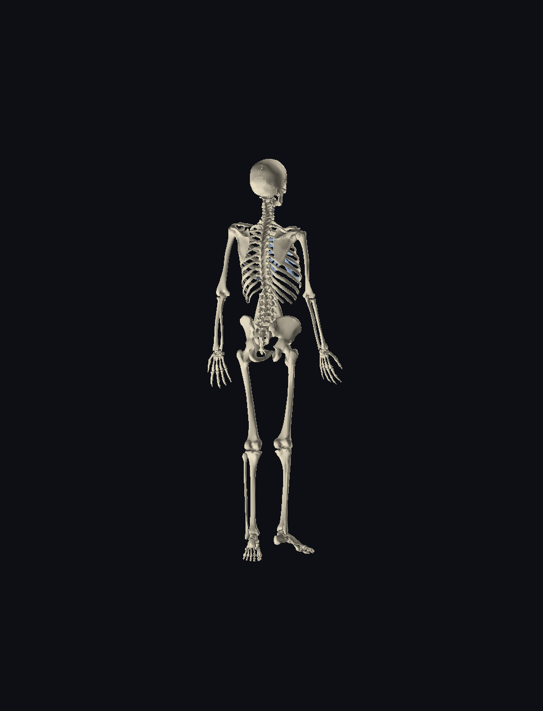
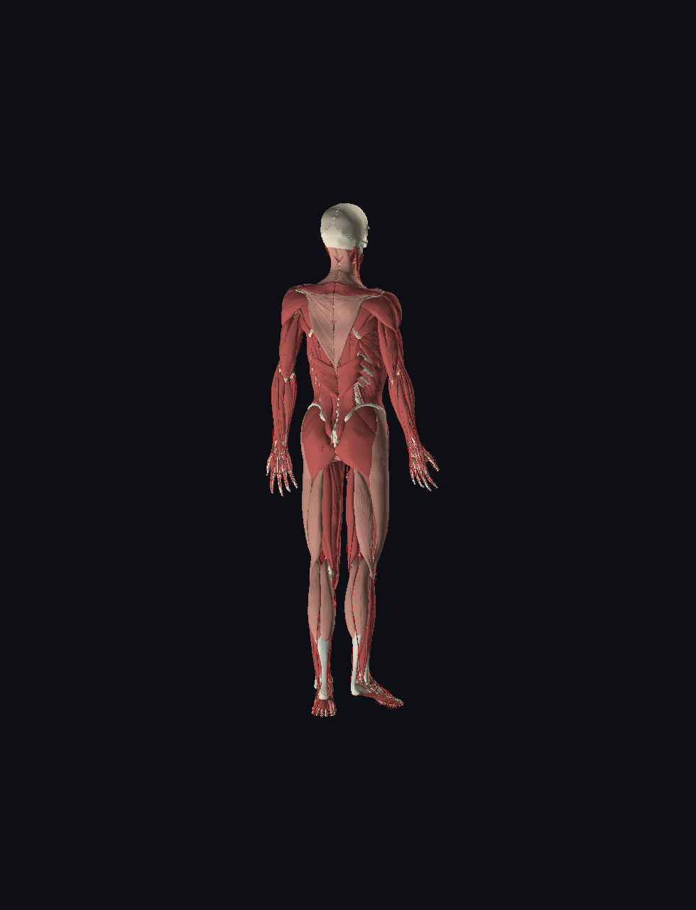

# fma — FMA-addressed 3D human anatomy

Real connected anatomical geometry (triangle meshes), addressed by the
Foundational Model of Anatomy (FMA), rendered solid on the CPU and served under
`/FMA`. Sibling of the cubus `/torso` route — same idea, real geometry.

> Three things, one system: **geometry** (triangles) ⟷ **address** (canonical
> GUID per part) ⟷ **route** (`/FMA`, `/FMA/turntable`, `/FMA/live`).

 

602K-triangle skeleton · 6.2M-triangle tissue body · `docs/frame_0067.png` is one
turntable frame.

## Pipeline

```
BodyParts3D meshes ──tissue (is_a tree)──► triangle rasterizer (z-buffer + Gouraud)
       │                                          └─► solid renders / 360 turntable
       └──part_of distinguished name──► canonical GUID  classid::HEEL::HIP::TWIG::F4::F5:IDENTITY
                                         (prefix-routable cascade + golden-stride identity mint)
```

- **Geometry** is the real mesh triangles (not gaussian splats): per-triangle
  z-buffered fill with smooth per-vertex (Gouraud) normals, two-sided shading,
  FMA-tissue color (bone ivory, muscle red, vessel red, nerve yellow, …).
- **Address** is the OGAR-canon node key: each part's **distinguished name** is
  its `part_of` ancestry (`human body / cardiovascular system / … / aorta`);
  the GUID cascade tiers are FNV-1a of the cumulative ancestor prefix (so
  siblings share leading groups — prefix-routable), and the **IDENTITY** tier is
  the **golden-stride mint** (`GOLDEN_RATIO × EULER_GAMMA`, stride-4/offset-20 —
  the helix CurveRuler, same generator as bgz17 / bgz-hhtl-d / helix).

## Binaries

| bin | what |
|---|---|
| `mesh` | static solid render (`bones` / `tissues` / `all`) → `mesh/mesh_<mode>.png` |
| `turntable` | parallel 360° prerender, N frames → `fma_frames/frame_NNNN.png` |
| `serve` | dep-free std HTTP server, all routes under `/FMA` (binds `0.0.0.0:$PORT`) |
| `guid` | mint the part_of GUID per FMA node → `guid/guid_manifest.tsv`, `guid/fj_guid.tsv` |
| `converge` | **v3**: cascading-HHTL `(part_of:is_a)` **canonical NodeGuid** → `guid/guid_converged.tsv` |
| `anchor` | compression study: cascade vs raw-cartesian vs Cartesian-Skeleton hybrid |

## Routes (`serve`)

All under `/FMA` — no case-only `/fma` vs `/FMA` overlap.

| route | serves |
|---|---|
| `GET /FMA` | viewer: renders + tissue legend + live part lookup |
| `GET /FMA/skeleton.png`, `GET /FMA/body.png` | solid skeleton / tissue body (PNG) |
| `GET /FMA/guid/<FMAID>` | `{container, guid, distinguished_name}` (JSON) |
| `GET /FMA/manifest` | full GUID manifest (TSV) |
| `GET /FMA/turntable` | 360° turntable, 90 fps autoplay (LazyLock-prebuffered frames) |
| `GET /FMA/live` | interactive drag-to-rotate over the same frames |
| `GET /FMA/frame/<i>` | one turntable frame (PNG, from the RAM prebuffer) |

## Three coexisting FMA addressings (lose neither version)

The Ada workspace has two independent FMA bodies of work; this crate adds a third
that converges them **without replacing either** — disjoint files, disjoint routes:

| version | what | axis | where |
|---|---|---|---|
| **v1** (other session) | FMA **heart** graph, canonical `NodeGuid`, served at **`/fma`** | `is_a` (taxonomy) | `crates/osint-bake/.../fma.rs`, `cockpit/.../FmaGraph.tsx` |
| **v2** (this crate, `guid`) | **full-body** part_of FNV cascade + 3D mesh at **`/FMA`** | `part_of` (mereology) | `fma/src/bin/guid.rs` |
| **v3** (this crate, `converge`) | cascading-HHTL **canonical `NodeGuid`** | **`(part_of:is_a)`** | `fma/src/bin/converge.rs` |

**v3 is the convergence.** Each 8:8 HHTL tier packs both axes — `high = part_of`
(mixin / family / basin: *where*), `low = is_a` (identity / type: *what*) —
cascading HEEL→HIP→TWIG so the high-byte chain prefix-routes the body partonomy
and the low-byte chain prefix-routes the type taxonomy: **both hierarchies in one
key, routable on either axis at every level.** The 16-byte layout is byte-identical
to `lance_graph_contract::canonical_node::NodeGuid` (OGAR canon, locked 2026-06-13:
`classid·HEEL·HIP·TWIG·family·identity`), and `classid` uses the same `0x0A0x`
`ConceptDomain::Anatomy` space as v1's bake (`0x0A01` soft tissue, `0x0A02`
skeleton) — so a heart node from v1 and a heart node from v3 share `classid`. v3
is dep-free (emits the canonical bytes directly) so this crate stays standalone.

```text
aorta subtree (v3):  classid  HEEL HIP  TWIG  family·identity
  FMA3736 ascending  00000a01-0901-0702-0e02-000105·880ff7   part_of:ascending aorta  is_a:ascending aorta
  FMA3789 abdominal  00000a01-0901-0702-0e02-000305·aea610   part_of:abdominal aorta  is_a:abdominal aorta
  ^ shared classid + HEEL/HIP/TWIG = same region AND same vessel type; tail disambiguates
```

## Run

```sh
./fetch_data.sh                                  # BodyParts3D meshes + combined map
cargo run --release --bin guid                   # v2 part_of GUID manifest
cargo run --release --bin converge               # v3 (part_of:is_a) canonical NodeGuid → guid/guid_converged.tsv
cargo run --release --bin mesh -- data/isa_parts/isa_BP3D_4.0_obj_99 \
    data/combined_element_parts.txt data/inclusion.txt data/isa_inclusion.txt mesh tissues
cargo run --release --bin turntable              # 270 frames (3s @ 90fps)
PORT=8088 cargo run --release --bin serve        # open http://localhost:8088/FMA
```

Build with AVX-512 (x86-64-v4): `RUSTFLAGS="-C target-cpu=native"` (or `x86-64-v4`).

## Data & attribution

`data/*.txt` are the small BodyParts3D ID/relation maps (committed). The meshes
are fetched by `fetch_data.sh` (not committed).

- Geometry: **BodyParts3D**, © The Database Center for Life Science, licensed
  under **CC Attribution-Share Alike 2.1 Japan**.
- Ontology: **Foundational Model of Anatomy (FMA)**.
- Code: Apache-2.0.
